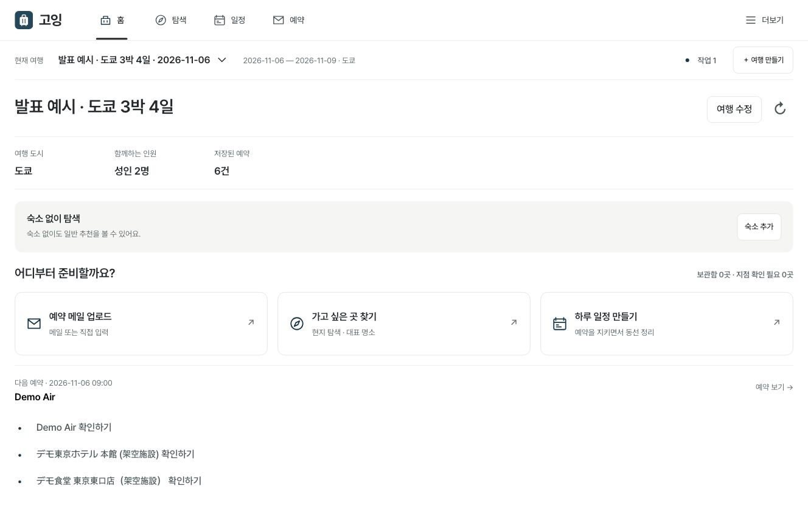
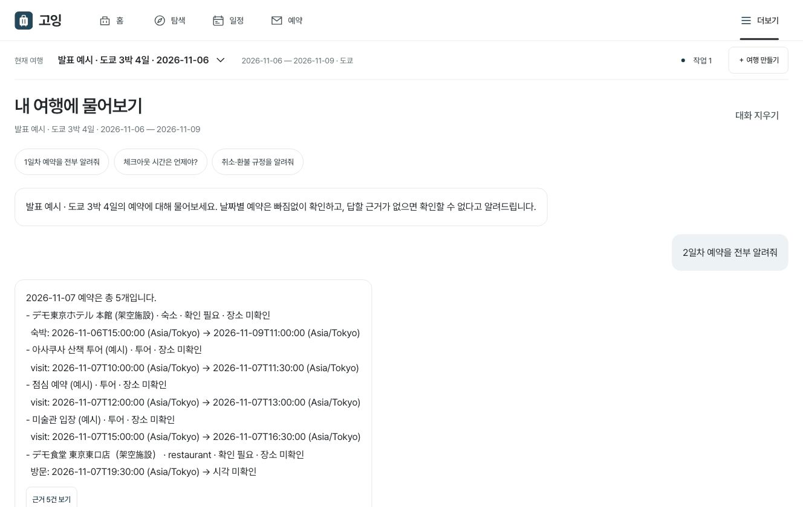
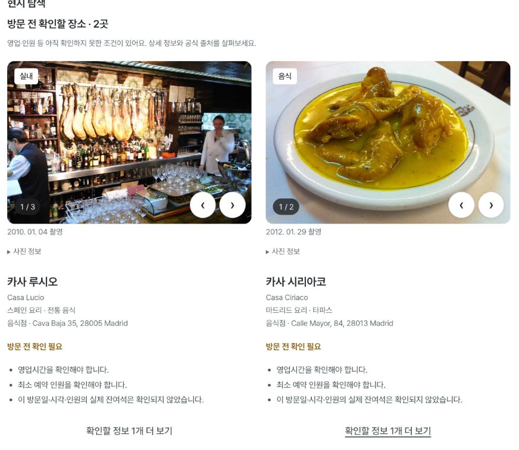

<div align="center">


여행 메일을 정리하고, 가고 싶은 곳을 찾아 일정에 담습니다.

[서비스](https://travel-inbox-rag.onrender.com) · [주요 기능](#주요-기능) · [추천 모델](#추천-모델) · [실행하기](#실행하기) · [발표 자료](#발표-자료)

<sub>소수 지인용 비공개 베타 · 초대된 Google 계정으로 로그인</sub>

</div>



## 만든 이유

여행하는 것과 새로운 음식점을 찾아다니는 것을 좋아합니다. 다만 여행을 갈 때마다 식당을 찾고, 리뷰를 읽고, 숙소에서 얼마나 먼지 비교하는 일이 반복됐습니다. 예약한 뒤에도 시간이나 이용 조건을 확인하려면 메일함을 다시 뒤져야 했습니다.

고잉은 이 과정을 한곳에서 이어서 할 수 있도록 만든 개인 프로젝트입니다. 예약 메일을 읽고 질문에 답하는 기능으로 시작했고, 지금은 장소를 고르고 여행 일정에 넣는 기능까지 만들었습니다.

특히 **현지어 리뷰를 참고해 식당을 찾는 방식**에 관심을 두고 있습니다. 한국어로 많이 알려진 곳 외에도 살펴볼 수 있도록 하되, 유명한 식당이나 대표 명소를 찾는 선택지도 따로 제공합니다. 리뷰 언어만으로 현지 주민이 쓴 리뷰라고 판단하지는 않습니다.

## 주요 기능

### 예약 메일 정리와 질문

`.eml`·`.txt` 메일을 올리면 날짜, 시간, 장소를 추출해 예약으로 정리합니다. 한 메일의 여러 예약과 왕복 항공편을 나눠 보관하고, 잘못 읽은 값은 직접 고칠 수 있습니다. 메일이 없어도 수동으로 예약을 추가할 수 있습니다.

“2일차 예약을 전부 알려줘”라고 물으면 해당 날짜의 예약을 모두 조회합니다. 환불 규정처럼 메일 본문이 필요한 질문에는 검색한 근거와 원문을 함께 보여줍니다.

| 메일 업로드 | 질문과 출처 |
| :---: | :---: |
|  |  |

분석이 실패하면 이전 예약을 유지합니다. 처리 상태를 저장하므로 새로고침한 뒤에도 작업을 확인할 수 있습니다. AI 추출값과 사용자가 고친 값도 따로 보관합니다.

### 장소 추천과 비교

여행의 도시와 날짜를 이어받아 **현지어 리뷰로 찾기 / 유명한 곳** 중에서 탐색합니다. 음식점·카페·볼거리는 별도 필터로 고릅니다. 취향이나 숙소를 입력하면 순위에 반영하고, 입력하지 않으면 확인된 기본 근거로 시작합니다.

카드에서 사진과 추천 이유를 보고, 상세에서 영업·예약·가격의 출처를 확인할 수 있습니다. 관심 있는 장소는 보관함에 저장하고 같은 날짜·인원 조건으로 최대 3곳을 비교합니다. 위치가 확인된 숙소를 기준으로 거리를 비교할 수 있으며, 직선거리와 실제 이동시간을 구분합니다.



| 추천 방식 | 사용하는 근거 |
| :--- | :--- |
| 현지어 리뷰로 찾기 | 관측한 원문 리뷰의 현지어·한국어·미판별 구성. 자료 자격과 언어 품질을 통과한 후보만 사용 |
| 유명한 곳 | 공식 대표성, 같은 플랫폼의 평가 규모·평점, 편집 자료의 선정 이유를 각각 구분 |
| 주변 장소 참고 | 공개지도에서 확인한 지점·위치. 리뷰 근거가 있는 추천과 구분해서 표시 |

**엄격한 현지어 리뷰 추천은 현재 OFF입니다.** 수집 어댑터와 집계·추천 코드는 구현했지만, 실제 리뷰의 이용 범위와 언어 판별 품질 검증은 남아 있습니다. 추천 수가 부족하다고 기준을 자동으로 낮추거나 주변 장소로 채우지는 않습니다.

### 일정 생성과 편집

확정 예약을 먼저 배치하고, 장소를 추가할 때 앞뒤 이동시간과 체류시간, 영업시간을 함께 검사합니다. 변경은 **미리보기 → 적용 → 되돌리기** 순서로 진행합니다. 기존 예약끼리 시간이 겹치면 자동으로 옮기지 않고 충돌을 보여줍니다.


### 여행 준비와 현장 사용

| 기능 | 할 수 있는 일 |
| :--- | :--- |
| 예약 준비 | 예약 오픈 규칙과 할 일 관리, 캘린더용 ICS, 현지어 문의문 초안 |
| Plan B | 비·휴무·피로 등의 상황에서 영향을 받는 구간의 대체안 미리보기 |
| 오늘 보기 | 여행지 현지 날짜 기준 다음 일정과 확인할 일 조회 |
| 오프라인 | 여행별로 선택한 최소 정보를 기기에 저장해 읽기. 운영 활성화·기기별 검증은 별도 |
| 예상 지출 | 통화별 알려진 금액 범위와 가격 미확인 항목 표시 |
| 피드백 | 추천 제외, 방문 경험, 장소 정보 오류 신고를 구분해 기록 |

예약·결제·문의 발송은 사용자가 직접 진행합니다. 일정에서 장소를 빼도 외부 예약이 취소되지는 않습니다.

<sub>화면은 2026-10-07 합성 계정·가상 예약으로 촬영했습니다. 장소 화면은 공개 출처가 있는 실제 지점이며, 최신 모델의 계산 근거 화면은 포함하지 않습니다. [화면·사진 출처](docs/presentation/CREDITS.md)</sub>

## 추천 모델

현재 코드의 기본 모델은 **`hybrid_v4`**입니다. 장소 정보와 여행 조건을 조합하는 콘텐츠 기반 추천 모델로, 사용자 클릭이나 방문 이력을 학습한 모델은 아닙니다. 순위 계산에 LLM을 호출하지 않고 아래 특징을 직접 계산합니다.

| 특징 | 계산 방법 |
| :--- | :--- |
| 취향 | 선택한 취향과 확인된 장소 태그의 **TF-IDF 코사인 유사도**. 초밥·寿司·sushi 같은 태그는 버전 관리하는 사전으로 연결 |
| 평점 | **평균 수축**으로 평가 수가 적은 장소의 평점을 같은 플랫폼·도시·유형의 평균 쪽으로 보정 |
| 거리 | 숙소 등 명시한 출발점과의 직선거리. `1 / (1 + 거리 / 2km)`로 가까운 곳에 높은 값 부여 |
| 추천 구획의 근거 | 현지어 추천은 언어 구성과 보정 평점, 유명한 곳은 근거 유형별 자격 또는 보정 평점 사용 |

취향과 출발점이 모두 있으면 **구획 근거 40% + 취향 40% + 거리 20%**를 사용합니다. 입력 조합에 따라 미리 정한 프로필을 고르며, 이 비중은 학습 결과가 아닌 초기 설정입니다. 필요한 자료가 없으면 미확인으로 남기고 후보마다 비중을 다시 나누지 않습니다.

지점·자료 자격, 휴무, 인원 같은 필수 조건은 점수 계산 전에 검사합니다. 높은 평점으로 조건 위반을 상쇄하지 않습니다. 공식 명소와 플랫폼 인기 등 근거가 다른 그룹도 유지합니다. 카드의 **이 추천의 계산 근거**에서 성분과 비중, 일치한 태그, 미확인 항목을 확인할 수 있습니다.

[모델 수식·프로필·결측 처리](docs/service-v4/RECOMMENDATION_MODEL.md) · [순위 계산 코드](src/recommendations/hybrid.py) · [이전 모델](docs/service-v4/RECOMMENDATION_MODEL_V3.md)

### 이전 버전과 비교

`general_v3`는 리뷰 비율이나 평가 수를 차례로 비교하는 규칙 기반 모델이었습니다. `hybrid_v4`에서는 취향 유사도와 거리를 실제 순위에 반영하고, 적은 평가 수에 따른 평점 편차를 줄였습니다.

두 모델에 **같은 여행 조건·후보·시각**을 넣어 비교했습니다. 도쿄·바르셀로나의 취향, 거리, 평점, 선택 입력 없음, 조건 위반 등을 다룬 **합성 개발 시나리오 12개**, 상위 3개 기준입니다. 정답 등급도 개발자가 작성했습니다. 독립 평가 자료는 아직 0개입니다.

| 지표 | `general_v3` | `hybrid_v4` |
| :--- | ---: | ---: |
| NDCG@3 — 적합한 후보가 앞에 오는 정도 | 0.4155 | **0.9954** |
| Precision@3 — 상위 3칸 중 적합 후보 비율 | 0.3889 | **0.7778** |
| Recall@3 — 적합 후보 중 상위 3개에서 찾은 비율 | 0.3500 | **0.9333** |
| MRR@3 — 첫 적합 후보 순위의 역수 | 0.3889 | **1.0000** |
| 확인된 필수 조건 위반 | 0건 | 0건 |
| 입력 순서를 바꿔도 같은 결과 | 12/12 | 12/12 |
| 순수 엔진 중앙값 / p95, 각 60회 | 10.10 / 10.87ms | 11.14 / 11.99ms |

**NDCG 0.9954는 “정확도 99.54%”가 아닙니다.** 정해 둔 합성 시나리오에서 순위가 기대에 가까워졌다는 결과입니다. 실제 추천 정확도와 방문 만족도는 아직 측정하지 않았습니다. 지연은 DB·네트워크·큐·화면을 제외한 로컬 엔진 값이며, 새 모델의 계산 시간은 조금 늘었습니다.

[전체 결과와 질의별 순위](docs/service-v4/reports/hybrid-v4-benchmark.md) · [평가 데이터](docs/service-v4/fixtures/hybrid-v4-development.json) · [지표 정의·독립 평가 방법](docs/service-v4/RECOMMENDATION_MODEL.md#평가-방법과-결과-해석)

## 구현과 실행

FastAPI가 PWA 화면과 API를 제공합니다. 운영은 Render Free와 Supabase의 PostgreSQL·비공개 Storage·pgvector를 사용하고, 로컬은 SQLite·Chroma를 사용합니다. 메일의 AI 추출은 OpenAI **`gpt-5-mini`**, 검색 임베딩은 **`text-embedding-3-small`**입니다. 추천 순위 계산과 일정 제약 검사는 별도 서버 코드에서 처리합니다.

```text
web/                    화면과 PWA
src/foundation/         인증, 여행, 예약, 원문
src/reliability/        작업 복구, 검색 갱신, 호출 예산
src/discovery/          장소, 지점, 사진
src/research/           리뷰 수집, 언어 분석, 품질 검증
src/recommendations/    추천 모델, 근거 설명, 비교 평가
src/itineraries/        일정 생성, 검증, 편집
```

### 실행하기

Python 3.13 기준입니다. 외부 계정·유료 호출 없이 예시 화면부터 볼 수 있습니다.

```bash
git clone https://github.com/Jin-s-work/Travel-Agent.git
cd Travel-Agent
python3.13 -m venv .venv
.venv/bin/python -m pip install -r requirements-dev.txt
PYTHON_DOTENV_DISABLED=1 .venv/bin/python scripts/presentation_browser_fixture.py
```

`http://127.0.0.1:8766`에서 합성 사용자 A로 로그인합니다. 임시 DB를 쓰는 로컬 예시이며, 운영용 인증이 아닙니다. 직접 올려 볼 메일과 기대 결과는 [메일 테스트 팩](examples/mail-test-pack/)에 있습니다.

실제 로그인과 AI를 연결할 때는 [인증·초대 안내](docs/service-v2/FOUNDATION_RUNBOOK.md)와 [`.env.example`](.env.example)을 따릅니다. 비밀값은 Git에 올리지 않는 `.env` 또는 호스팅 secret에 둡니다.

```bash
test -e .env || cp .env.example .env
# 인증·초대·저장소·필요한 공급자를 설정한 뒤 실행
.venv/bin/python -m uvicorn api:app --host 127.0.0.1 --port 8000 --workers 1 --no-access-log
```

단일 worker·dispatcher로 실행합니다. 외부 호출은 [예산 설정](deploy/render-supabase/pricing-openai.json)을 확인한 뒤 켜며, 모델 비교 명령 자체는 유료 API를 사용하지 않습니다.

### 테스트와 모델 평가

```bash
PYTHON_DOTENV_DISABLED=1 .venv/bin/python -m pytest tests -q
npm ci --ignore-scripts
node --test tests/*.cjs

PYTHON_DOTENV_DISABLED=1 .venv/bin/python -m src.recommendations.benchmark \
  --fixture docs/service-v4/fixtures/hybrid-v4-development.json \
  --output /tmp/going-ranking-evaluation.json --repeats 5
```

2026-10-08 코드 검증: **Python 1,156 passed·17 skipped, JavaScript 177 passed**. 외부 환경이 필요한 skip은 통과 수에 포함하지 않았습니다. 실행 명령과 미검증 범위는 [검증 기록](docs/service-v4/reports/hybrid-v4-validation.md)에 있습니다.

## 현재 범위와 다음 작업

도시 입력은 **100개 도시**를 지원합니다. 모든 도시에서 같은 수준의 추천 자료가 준비됐다는 뜻은 아닙니다. 새로 검수한 후보 팩은 도쿄·바르셀로나 각 6곳이며, 기존 마드리드 등의 자료도 보존하고 있습니다. 사진·영업·예약 정보가 부족한 곳은 미확인으로 표시합니다.

이 저장소의 최신 코드와 운영 배포 상태는 다를 수 있습니다. 엄격 언어 추천의 실제 품질 검증, 새 모델 화면의 브라우저 확인, 오프라인 기기별 검증은 남아 있습니다.

앞으로는 다음 순서로 보완하려고 합니다.

1. **실제 리뷰 검증** — 도쿄·바르셀로나부터 이용 범위와 원문 언어 품질을 확인하고, 통과한 도시에서 현지어 추천을 켭니다.
2. **독립적인 추천 평가** — 모델 순위를 보지 않은 평가자가 후보를 평가하고, 개발 자료와 분리한 데이터로 비교합니다.
3. **자료와 사용 경험 보완** — 장소 태그·예약 조건·이동 경로를 채우고, 실제 사용에서 저장·일정 채택·방문 경험을 나눠 확인합니다. 학습 기반 개인화는 그 자료가 쌓인 뒤 비교합니다.

[전체 진행 기록](docs/service-v4/IMPLEMENTATION_STATUS.md) · [배포 안내](docs/operations/RENDER_SUPABASE.md) · [백업·복구](docs/operations/RUNBOOK.md) · [초기 README](docs/history/README-before-going.md)

<a id="발표-자료"></a>

[Keynote](docs/presentation/v5/going-v5-class-presentation.key?raw=1) · [PowerPoint](docs/presentation/v5/going-v5-class-presentation.pptx?raw=1) · [발표 자료 안내](docs/presentation/v5/README.md)

<sub>[수업 발표 PDF](docs/presentation/going-class-presentation.pdf) · 기존 PDF이며 최신 모델 설명은 위 자료에 있습니다.</sub>
