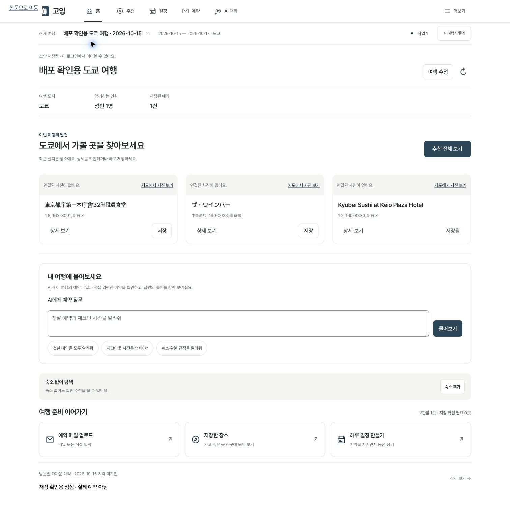
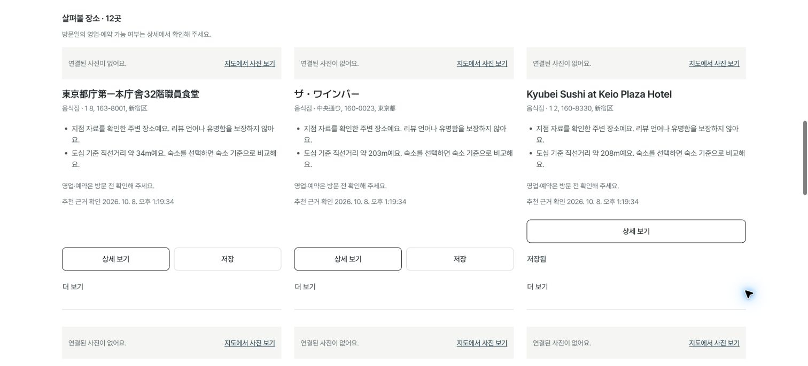
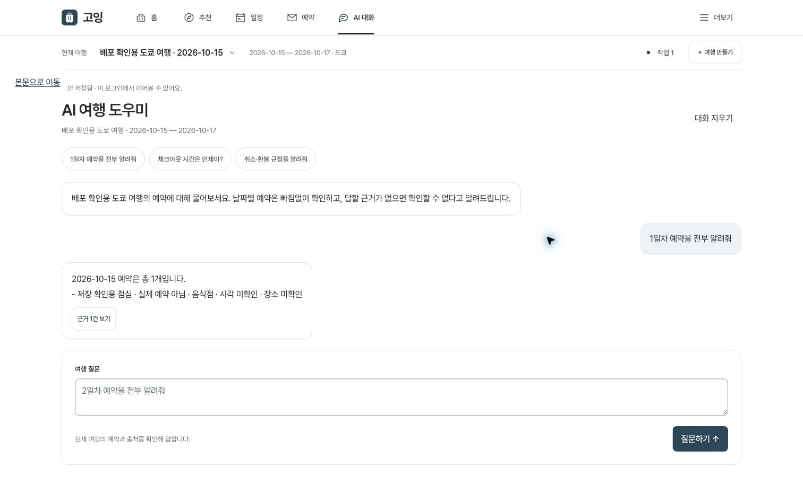
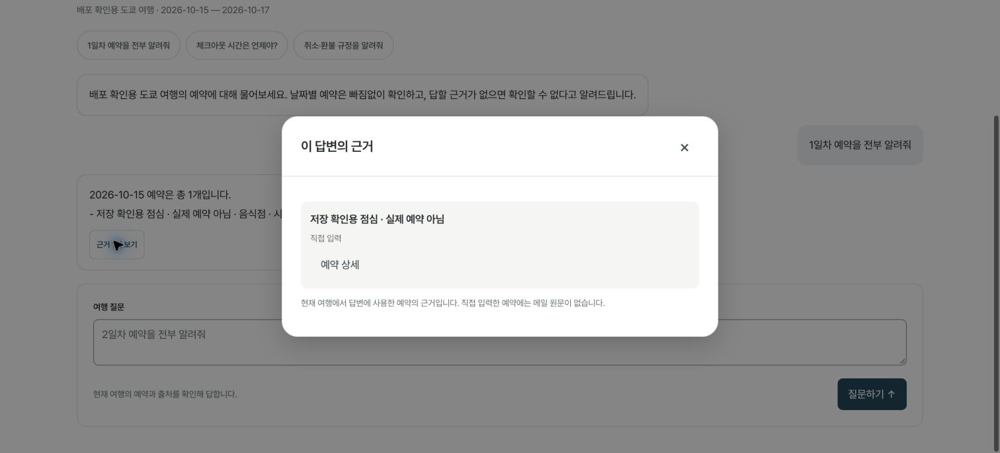
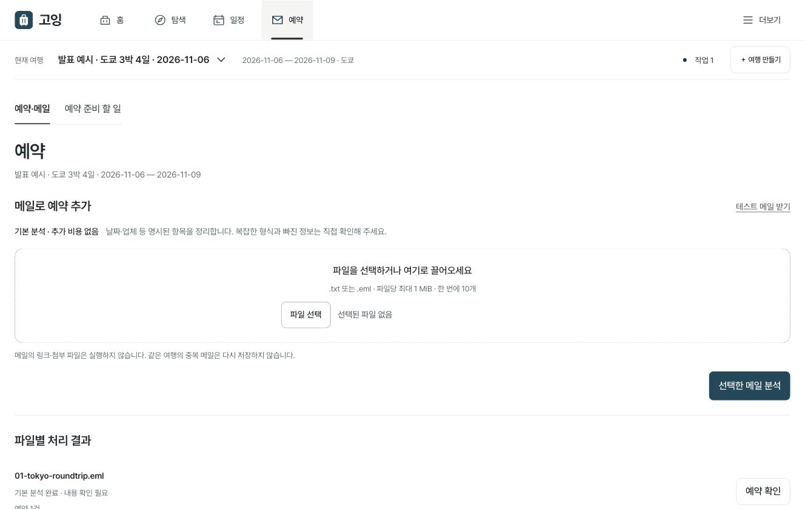
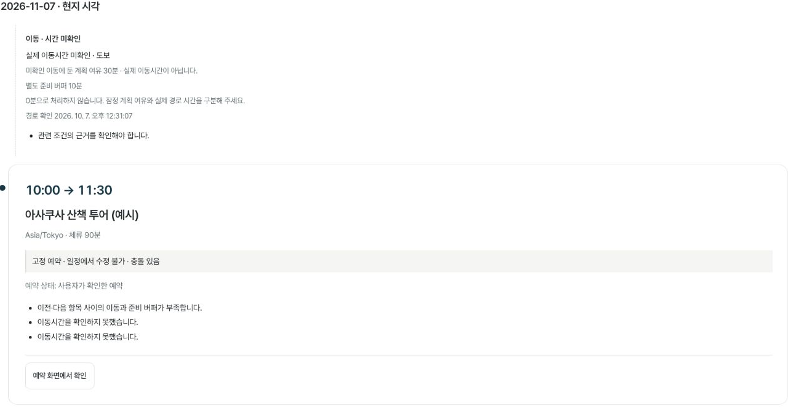

<div align="center">


가볼 곳을 찾고, 예약을 확인하고, 하루 일정을 만듭니다.

[서비스](https://travel-inbox-rag.onrender.com) · [사용 흐름](#사용-흐름) · [추천 모델](#추천-모델) · [실행하기](#실행하기) · [발표 자료](#발표-자료)

<sub>소수 지인용 비공개 베타 · 초대된 Google 계정으로 로그인</sub>

</div>

## 만든 이유

여행하는 것과 새로운 음식점을 찾아다니는 것을 좋아합니다. 그런데 여행을 갈 때마다 식당을 찾고, 리뷰를 읽고, 숙소에서 얼마나 먼지 비교하는 일이 반복됐습니다. 예약한 뒤에도 시간이나 이용 조건을 보려면 메일함을 다시 뒤져야 했습니다.

고잉은 이 과정을 한곳에서 이어서 해 보려고 만든 개인 프로젝트입니다. 예약 메일에 질문하는 기능으로 시작해 장소 추천과 일정 편집까지 연결했습니다. 기능이 늘면서 입력과 메뉴 이동도 많아져, 최근에는 **여행 조건을 재사용하고 추천과 AI 질문을 메인에서 바로 시작하는 흐름**으로 정리했습니다.

특히 현지어 원문 리뷰를 참고해 식당을 찾는 방식에 관심이 있습니다. 한국어로 많이 알려진 곳 외에도 살펴볼 수 있게 하면서, 유명한 식당과 대표 명소를 찾는 선택지도 따로 두었습니다. 리뷰 언어만으로 작성자가 현지 주민이라고 판단하지는 않습니다.

## 사용 흐름

1. **여행 만들기** — 도시와 날짜로 시작합니다. 숙소·취향·예산은 필요할 때 더합니다.
2. **가볼 곳 찾기** — 메인의 최근 장소에서 상세를 보거나 저장합니다. 추천 화면에서도 같은 여행 조건을 사용합니다.
3. **예약과 일정 이어가기** — 예약 메일을 정리하고 AI에게 질문합니다. 고른 장소는 확정 예약을 보존하는 일정에 넣습니다.



<sub>2026-10-08 배포 화면의 가상 도쿄 여행입니다. 사진을 확보하지 못한 장소에는 실제로 사진 없음 상태가 표시됩니다.</sub>

## 주요 기능

### 장소 추천과 보관함

여행의 도시·날짜·인원을 이어받아 탐색합니다. 음식점·카페·볼거리는 간단한 필터로 고르고, 취향이나 예산을 더 정할 때만 상세 조건을 엽니다. 추천 중 다른 화면으로 이동해도 진행 상태를 확인하고 완료된 결과를 이어볼 수 있습니다.

| 탐색 구획 | 사용하는 자료 |
| :--- | :--- |
| 둘러보기 | 공개지도에서 확인한 지점과 위치. 리뷰 자격을 통과한 추천과 구분 |
| 현지어 리뷰로 찾기 | 관측한 원문 리뷰의 현지어·한국어·미판별 구성. 이용 범위와 언어 품질을 통과한 후보 |
| 유명한 곳 | 공식 대표성, 같은 플랫폼의 평가 규모·평점, 편집 자료의 선정 이유 |

**엄격한 현지어 리뷰 추천은 현재 OFF입니다.** 수집·집계·추천 코드는 구현했지만 실제 리뷰의 이용 범위와 언어 품질 검증이 남았습니다. 자료가 부족하다고 기준을 낮추거나 일반 장소를 현지어 추천으로 채우지 않습니다.



카드에서 상세를 열거나 바로 저장할 수 있습니다. 저장한 곳은 `저장됨`으로 표시하고 보관함으로 연결합니다. 상세에서는 영업·예약·가격의 출처를 확인하고, 같은 방문일과 인원으로 최대 3곳을 비교합니다.

숙소 좌표가 확인되면 숙소와의 거리를 사용합니다. 출발점을 고르지 않았다면 도심 기준 거리를 명시합니다. 선택한 숙소의 위치를 확인하지 못한 경우에는 거리를 미확인으로 남깁니다. **직선거리와 실제 이동시간은 구분합니다.**

사진은 지점과 이용 조건을 확인한 자료가 있을 때 최대 3장을 보여줍니다. OSM·Wikidata·Wikimedia Commons 연결 처리를 보완해 실제 파리 식당 사진 표시를 확인했지만, 무료 자료에 사진이 없는 식당은 여전히 많습니다. 없는 사진을 임의로 채우지 않고 지도에서 확인하는 링크를 제공합니다.

### 메인에서 시작하는 AI 질문

메인 입력창이나 상단 **AI 대화**에서 현재 여행의 예약을 물어볼 수 있습니다. 예시 질문을 고르면 입력되고, 전송하면 대화와 출처 확인으로 이어집니다. 질문이 실패하면 입력을 유지합니다.

“첫날 예약을 모두 알려줘”는 날짜 범위로 조회해 해당 예약을 빠짐없이 가져옵니다. 환불 규정처럼 본문이 필요한 질문은 관련 메일을 검색해 답변의 근거를 연결합니다. 직접 입력한 예약과 메일에서 읽은 예약의 출처도 구분합니다.

| 날짜별 답변 | 사용한 근거 |
| :---: | :---: |
|  |  |

<sub>위 화면은 합성 예약에 대한 날짜 조회입니다. LLM의 자유 답변 품질을 측정한 예시는 아닙니다.</sub>

### 예약 메일 정리와 교정

`.eml`·`.txt` 메일을 올리면 날짜·시간·장소를 추출해 예약으로 정리합니다. 한 메일의 여러 예약과 왕복 항공편을 나눠 보관하고, 잘못 읽은 값은 직접 고칠 수 있습니다. 메일 없이 수동 예약부터 만들어도 됩니다.

분석 실패 시 기존 활성 예약을 유지하고 파일별 작업 상태를 저장합니다. AI 추출값과 사용자 교정값을 따로 보관해 재분석에서도 교정을 유지합니다.

<details>
<summary>메일 업로드 화면 보기</summary>



2026-10-07 로컬 합성 예시입니다. 메일은 기본 분석으로 처리했습니다. 직접 시험할 파일과 기대 결과는 [메일 테스트 팩](examples/mail-test-pack/)에 있습니다.

</details>

### 확정 예약을 보존하는 일정

확정 예약을 먼저 배치한 뒤 앞뒤 이동·체류·영업시간을 함께 검사합니다. 편집은 미리 확인하고 적용하며, 적용 후에도 되돌릴 수 있습니다. 고정 예약끼리 충돌하면 자동으로 옮기지 않고 충돌을 보여줍니다.



예약 준비 목록·ICS·현지어 문의문 초안, 상황별 Plan B, 오늘 보기, 통화별 예상 지출, 방문 피드백도 구현했습니다. 오프라인은 여행별 최소 정보를 저장하는 읽기 기능이며 운영 활성화와 기기 검증은 별도입니다. 예약·결제·문의 발송은 사용자가 직접 진행합니다.

## 추천 모델

현재 배포 코드의 기본 모델은 **`hybrid_v5`**입니다. 장소 자료와 여행 조건을 조합하는 콘텐츠 기반 모델입니다. 사용자 행동을 학습한 모델은 아니며 순위 계산에 LLM을 호출하지 않습니다.

| 성분 | 계산과 입력 |
| :--- | :--- |
| 취향 | 취향과 장소 태그의 **TF-IDF 코사인 유사도**. 초밥·寿司·sushi 등의 별칭을 사전으로 연결 |
| 평점 | 평가 수가 적은 장소를 같은 플랫폼·도시·유형의 평균 쪽으로 보정하는 **평균 수축** |
| 거리 | 확인된 출발점과의 직선거리. `1 / (1 + 거리 / 2km)`로 가까운 곳에 높은 값 부여 |
| 구획별 근거 | 현지어 구성, 공식·편집 근거 또는 보정 평점 등 각 구획에 맞는 자료 |

v5에서는 다국어 음식 별칭을 늘렸고, 허용·신선도 검사를 통과한 공개 음식 종류를 **잠정 취향 자료**로 반영합니다. 출발점을 고르지 않은 경우에는 버전과 출처를 저장한 도심 좌표를 사용합니다. 음식 종류로 알레르기나 식단 적합성을 추정하지 않습니다.

취향과 거리 기준이 모두 있으면 구획 근거 40%, 취향 40%, 거리 20%를 사용합니다. 입력 조합마다 미리 정한 프로필이 있으며, 비중은 초기 설정입니다. 필요한 자료가 없으면 미확인으로 남기고 후보마다 비중을 다시 나누지 않습니다. 지점·자료 자격·휴무·인원 등 필수 조건은 점수보다 먼저 검사합니다.

카드의 **이 추천의 계산 근거**에서 성분과 비중을 확인할 수 있습니다. 동일 입력을 재현할 수 있도록 조건·후보·모델 버전을 저장하며 이전 v4도 유지합니다.

[v5 코드](src/recommendations/hybrid_v5.py) · [v5 변경과 운영 검증](docs/service-v3/MAIN_RECOMMENDATION_UX.md) · [v4 수식과 평가 방법](docs/service-v4/RECOMMENDATION_MODEL.md)

### 평가한 것과 아직 모르는 것

**v5의 실제 추천 만족도와 독립 순위 평가는 미측정입니다.** 코드 시험과 운영 화면 확인을 사용자 성과로 계산하지 않습니다.

이전 `general_v3`와 `hybrid_v4`는 같은 입력의 **합성 개발 시나리오 12개**, 상위 3개 기준으로 비교했습니다. 정답 등급은 개발자가 작성했고 독립 평가 자료는 0개입니다.

| 기존 개발 평가 | `general_v3` | `hybrid_v4` |
| :--- | ---: | ---: |
| NDCG@3 | 0.4155 | 0.9954 |
| Precision@3 | 0.3889 | 0.7778 |
| Recall@3 | 0.3500 | 0.9333 |
| 확인된 필수 조건 위반 | 0건 | 0건 |

NDCG 0.9954는 정확도 99.54%를 뜻하지 않습니다. 정해 둔 예시에서 기대 순위에 얼마나 가까운지 본 값이며, **v5의 성능 수치로 사용하지 않습니다.** [전체 결과·지표 정의](docs/service-v4/reports/hybrid-v4-benchmark.md)

## 구현과 실행

FastAPI가 PWA와 API를 제공합니다. 운영은 Render Free와 Supabase PostgreSQL·비공개 Storage·pgvector를 사용하고, 로컬은 SQLite·Chroma를 사용합니다. 메일 AI 추출은 OpenAI **`gpt-5-mini`**, 검색 임베딩은 **`text-embedding-3-small`**입니다. 추천 순위와 일정 제약은 서버 코드로 계산합니다.

```text
web/                    화면과 PWA
src/foundation/         인증, 여행, 예약, 원문
src/reliability/        작업 복구, 검색 갱신, 호출 예산
src/discovery/          장소, 지점, 사진
src/research/           리뷰 수집, 언어 분석, 품질 검증
src/recommendations/    추천 모델, 근거 설명, 비교 평가
src/itineraries/        일정 생성, 검증, 편집
```

### 실행하기

Python 3.13 기준입니다. 외부 계정이나 유료 호출 없이 합성 예시 화면부터 볼 수 있습니다.

```bash
git clone https://github.com/Jin-s-work/Travel-Agent.git
cd Travel-Agent
# 현재 개발·배포 브랜치
git switch codex/private-beta-launch
python3.13 -m venv .venv
.venv/bin/python -m pip install -r requirements-dev.txt
PYTHON_DOTENV_DISABLED=1 .venv/bin/python scripts/presentation_browser_fixture.py
```

`http://127.0.0.1:8766`에서 합성 사용자 A로 로그인합니다. 임시 DB를 사용하는 로컬 예시이며 운영용 인증이 아닙니다.

실제 로그인과 AI 연결은 [인증·초대 안내](docs/service-v2/FOUNDATION_RUNBOOK.md)와 [`.env.example`](.env.example)을 따릅니다. 비밀값은 Git에 올리지 않는 `.env` 또는 호스팅 secret에 둡니다.

```bash
test -e .env || cp .env.example .env
# 인증·초대·저장소·필요한 공급자를 설정한 뒤 실행
.venv/bin/python -m uvicorn api:app --host 127.0.0.1 --port 8000 --workers 1 --no-access-log
```

단일 worker·dispatcher로 실행합니다. 외부 호출을 켜기 전 [예산 설정](deploy/render-supabase/pricing-openai.json)을 확인합니다.

### 검증 명령

```bash
PYTHON_DOTENV_DISABLED=1 .venv/bin/python -m pytest tests -q
npm ci --ignore-scripts
node --test tests/*.cjs

# 이전 general_v3 / hybrid_v4 합성 평가 재현. 유료 API 호출 없음.
PYTHON_DOTENV_DISABLED=1 .venv/bin/python -m src.recommendations.benchmark \
  --fixture docs/service-v4/fixtures/hybrid-v4-development.json \
  --output /tmp/going-ranking-evaluation.json --repeats 5
```

2026-10-08 코드 검증은 **Python 1,191 passed / 17 skipped, Node 196 passed**, 별도 격리 PostgreSQL 시험 **65 passed**입니다. 운영 Chrome에서 메인 질문·출처, 파리와 도쿄의 공개 후보 12곳 생성, 장소 저장을 확인했습니다. 외부 환경이 필요한 skip과 실물 모바일 미검증은 따로 남겼습니다. [명령·실측·남은 제한](docs/service-v3/MAIN_RECOMMENDATION_UX.md)

## 현재 범위와 다음 작업

도시 입력은 **100개 도시**를 지원합니다. 모든 도시에 동일한 추천 자료가 준비됐다는 뜻은 아닙니다. 사진·영업·예약 자료가 없는 장소는 미확인으로 표시합니다. 엄격 리뷰 추천은 실제 검증 전 OFF이며, 간헐적 서버 오류의 근본 원인도 추가 확인이 필요합니다.

앞으로는 다음 순서로 보완하려고 합니다.

1. **장소 자료 보강** — 사진과 방문 조건이 부족한 곳부터 채우고 출처·지점을 확인합니다.
2. **현지어 리뷰 검증** — 실제 자료의 이용 범위와 원문 언어 품질을 확인한 도시부터 켭니다.
3. **독립 평가와 실사용** — 모델 순위를 보지 않은 평가자의 판단과 실제 저장·일정 채택·방문 경험을 나눠 확인합니다. 휴대폰 사용성과 실패 흐름도 함께 점검합니다.

[최신 개선 기록](docs/service-v3/MAIN_RECOMMENDATION_UX.md) · [전체 진행 기록](docs/service-v2/IMPLEMENTATION_STATUS.md) · [배포 안내](docs/operations/RENDER_SUPABASE.md) · [백업·복구](docs/operations/RUNBOOK.md) · [초기 README](docs/history/README-before-going.md)

## 발표 자료

기존 디자인을 유지한 **11장, 영상 70초 포함 약 8분 30초** 구성입니다. 서비스의 기획 배경과 사용 흐름, 구현 방법을 소개합니다.

[Keynote](docs/presentation/v7/going-v7-class-presentation.key?raw=1) · [PowerPoint](docs/presentation/v7/going-v7-class-presentation.pptx?raw=1) · [발표 대본](docs/presentation/v7/SCRIPT.md) · [화면 영상](docs/presentation/v7/going-demo.mp4?raw=1) · [자료 안내](docs/presentation/v7/README.md)

<sub>[수업 발표 PDF](docs/presentation/going-class-presentation.pdf)는 이전 발표입니다. 최신 자료의 메인·AI·도쿄 탐색은 2026-10-08 운영 화면, 메일·일정과 사진 예시는 2026-10-07 합성 화면입니다. [화면과 사진 출처](docs/presentation/v7/CREDITS.md)</sub>
