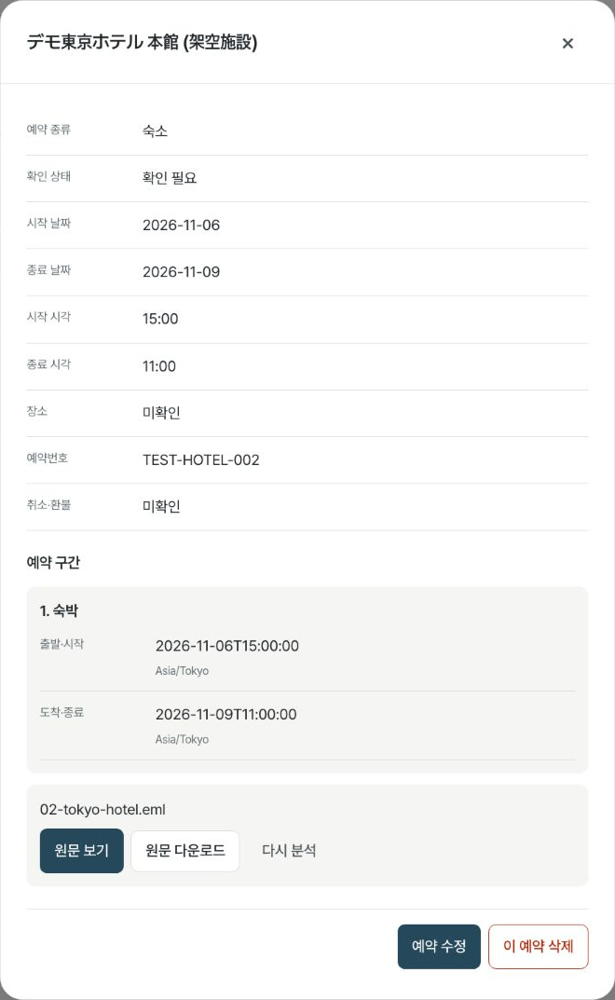

<div align="center">


**흩어진 예약을 모으고, 가고 싶은 곳을 일정으로 연결합니다.**

<p>


</p>

**[서비스 열기](https://travel-inbox-rag.onrender.com)** &nbsp;·&nbsp;
[발표 자료](docs/presentation/README.md) &nbsp;·&nbsp;
[작동 원리](#작동-원리) &nbsp;·&nbsp;
[해결 내용](#해결-내용) &nbsp;·&nbsp;
[평가 결과](#평가-결과)

<br>

<table>
<tr>
<td width="50%"></td>
<td width="50%"></td>
</tr>
<tr>
<td align="center"><b>한 여행에서 시작합니다</b><br>도시와 날짜를 예약·탐색·일정에서 이어 씁니다</td>
<td align="center"><b>근거를 보고 고릅니다</b><br>사진·출처와 아직 확인하지 못한 조건을 구분합니다</td>
</tr>
</table>

</div>

> **2026-10-07 기준 비공개 베타입니다.** 기존 Render Free 서비스에 배포했으며, 운영 자료는 Supabase에 보관합니다. 초대된 계정으로 로그인해야 개인 기능을 사용할 수 있습니다. OpenAI 메일 분석은 예산 제한을 두고 사용합니다. 엄격한 리뷰 언어 추천과 실제 경로 공급자는 별도 검증·설정이 필요한 상태입니다. [최신 운영 검증](docs/service-v3/reports/going-design-search-validation.md)
>
> 이 README의 화면은 현재 앱에서 **합성 계정·가상 메일·예약**으로 촬영했습니다. 식당은 공개 출처가 있는 실제 지점이며, 사진의 저작자·라이선스는 [자료 출처](docs/presentation/CREDITS.md)에 기록했습니다. 촬영한 메일 분석은 무료 기본 분석이며, 운영 OpenAI 실행 검증과 구분합니다.

## 개요

여행 한 번을 준비하면 확인 메일이 대여섯 통씩 쌓입니다. 항공권은 항공사에서, 숙소는 예약
사이트에서, 투어는 또 다른 플랫폼에서 옵니다. 필요한 정보는 모두 도착해 있지만 서로 다른
메일에 흩어져 있습니다.

체크아웃 시간을 확인하려면 메일함을 검색해 확인 메일을 찾고, 본문 중간의 표에서 시간을
읽어야 합니다. 식당을 정할 때는 지도에서 위치를 보고, 예약 방법을 따로 확인하고, 이미 잡힌
일정과 겹치지 않는지 다시 비교합니다.

고잉은 예약 메일을 구조화하고, 자연어 질문에 **어느 자료가 근거인지 함께** 답하는 프로젝트에서
시작했습니다. 지금은 사용자별 여행 관리, 장소 탐색·비교, 일정 생성·편집까지 같은 여행 안에서
이어지도록 확장했습니다. 저장소 이름 `Travel-Agent`와 초기 이름 `Travel Inbox RAG`는 개발 이력에 남아 있습니다.

## 주요 기능

| 기능 | 설명 |
| :--- | :--- |
| 여행 관리 | 도시·기간·인원을 저장하고 여러 여행을 전환합니다. 메일이나 숙소 없이도 시작할 수 있습니다 |
| 예약 메일 분석 | `.txt`·`.eml`에서 복수 예약과 왕복 구간을 추출합니다. 파일별 작업 상태와 실패 이유를 보여줍니다 |
| 예약 확인·교정 | 원문 추출값, 사용자 교정값, 현재 유효값을 구분합니다. 수동 예약도 추가할 수 있습니다 |
| 근거 기반 질문 | 날짜 질문은 SQL로 해당 날짜의 예약을 전부 가져옵니다. 설명형 질문은 검색 근거와 출처를 사용합니다 |
| 장소 탐색·보관함 | 현지 탐색과 대표 명소를 나누고 음식점·카페·볼거리를 별도로 고릅니다. 이름·링크·메모를 저장합니다 |
| 상세·사진·비교 | 운영·예약·가격을 필드별 출처와 함께 보여줍니다. 허용된 지점 사진과 최대 3곳 비교를 지원합니다 |
| 숙소 기준 탐색 | 위치가 확인된 숙소를 기준으로 거리 조건을 적용합니다. 직선거리와 실제 경로 시간은 구분합니다 |
| 일정 생성·편집 | 확정 예약을 보존하고 이동·체류·영업 조건을 검사합니다. 미리보기·적용·되돌리기로 편집합니다 |
| 여행 준비 | 예약 할 일, 오픈 규칙, ICS, 문의문 초안을 제공합니다. 자동 예약·결제·메시지 발송은 하지 않습니다 |
| 현장 사용 | Plan B와 오늘 보기를 제공합니다. 오프라인은 허용 필드만 저장하는 읽기 전용 기능이며 운영 활성화는 별도입니다 |
| 피드백·예상 지출 | 추천 제외와 방문 후 평가, 사실 오류 신고를 구분합니다. 미확인 가격과 통화별 합계를 보존합니다 |
| 저장과 복구 | 사용자 범위, 작업 상태, 검색 세대, 삭제 기록, 비용 예약·정산을 관리합니다 |

### 화면으로 보는 사용 흐름

**1. 여행을 만들고 예약 메일을 올립니다.** 도시와 날짜를 먼저 정하고, 다른 화면에서 같은 내용을
반복해서 입력하지 않도록 했습니다. 분석은 작업 번호로 추적하며 새로고침 후에도 상태를 확인합니다.


**2. 분석 결과를 확인하고 필요한 값을 고칩니다.** 메일에서 읽은 시각에 시간대가 없거나 날짜만
있으면 임의의 시각을 채우지 않습니다. 재분석 전에 기존 활성 예약을 삭제하지 않습니다.

<table><tr>
<td width="44%"></td>
<td width="56%"></td>
</tr><tr>
<td><b>예약 상세와 교정</b><br>원문과 현재 값을 확인합니다.</td>
<td><b>날짜별 질문</b><br>직접 입력한 예약도 조회에 포함합니다.</td>
</tr></table>

**3. 장소를 살펴보고 일정에 연결합니다.** 확인된 사실과 미확인 조건을 나눠 표시합니다.
자료가 부족한 후보를 방문 적합성이 검증된 추천처럼 표현하지 않습니다. 고정 예약의 시간이
충돌하면 자동으로 옮기는 대신 충돌을 보여줍니다.


### 도시와 데이터 범위

| 범위 | 현재 상태 |
| :--- | :--- |
| 도시 입력 | 100개 도시 레지스트리에서 도시·국가·시간대를 선택합니다 |
| 검수한 실제 장소 자료 | 도쿄·바르셀로나·마드리드 각 3곳. 개별 사실의 유효기간·방문 조건은 다시 검사합니다 |
| 새 도시 공개지도 탐색 | Photon/OSM의 실제 지점 자료를 제한된 범위로 조회하고 유효 캐시를 재사용합니다 |
| 운영 런던 검증 | 지점 50곳 수신, 음식점 후보 12곳 표시. **방문 조건을 모두 검증한 추천은 0곳**입니다 |
| 사진 | 지점·권한을 확인한 자료가 있는 장소에만 표시합니다. 모든 장소에 사진 3장을 보장하지 않습니다 |
| 리뷰 언어 | 수집 어댑터·집계·평가 도구 구현. 실제 수집·이용·품질 검증 전 엄격 기능은 OFF입니다 |
| 실제 이동시간 | 경로 공급자가 유효하게 설정된 경우에만 사용합니다. 운영에서 미확인인 값을 0분으로 만들지 않습니다 |

**100개 도시를 고를 수 있다는 것과 100개 도시의 추천 품질을 검증했다는 것은 다릅니다.**
무료 공개지도는 영업·가격·사진·리뷰·특정 날짜의 잔여석을 모두 제공하지 않습니다.
도시별 후보가 부족하면 부족한 이유를 보여주며, 합성 장소로 결과 수를 채우지 않습니다.

## 작동 원리

```text
브라우저 · PWA
  └─ FastAPI / 사용자·여행 범위 검증
       ├─ 메일 업로드 → SQL job → 추출 → 예약·이벤트 → 새 검색 세대 활성화
       ├─ 날짜 질문 → SQL 현재 예약 조회 → 출처 표시
       ├─ 설명형 질문 → 여행별 검색 → 근거 기반 답변
       ├─ 여행 조건 → 후보·사실 검사 → 점수·다양성 → 추천·비교
       └─ 고정 예약·장소 → 일정 검증 → preview → apply → 새 revision

운영: Render Free (단일 worker·dispatcher)
      Supabase PostgreSQL / 비공개 Storage / pgvector
로컬: SQLite / 비공개 원문 디렉터리 / Chroma
```

메일 추출은 `gpt-5-mini`, 검색 임베딩은 `text-embedding-3-small`을 사용합니다. 키·단가·예산·
외부 호출 허용 조건이 충족되지 않으면 지원 가능한 메일을 무료 기본 분석으로 처리합니다.
기본 분석은 모든 메일 형식을 이해하지 못하므로 원문 확인·사용자 교정·수동 입력이 필요합니다.

AI는 구조화 추출과 근거 설명을 맡습니다. 사용자 소유권, 날짜 범위, 비용 한도, 추천 자격,
고정 예약, 일정 충돌과 버전 검사는 서버 코드가 담당합니다. 개인 문서와 공용 장소·리뷰 자료는
같은 검색 저장소에 섞지 않습니다.

| 영역 | 주요 코드 |
| :--- | :--- |
| 인증·여행·예약·원문 | [`src/foundation/`](src/foundation/) |
| 작업·검색 갱신·예산 | [`src/reliability/`](src/reliability/) |
| 리뷰 관측·언어 품질 | [`src/research/`](src/research/) |
| 장소·추천·근거 | [`src/discovery/`](src/discovery/) |
| 일정 생성·검증·편집 | [`src/itineraries/`](src/itineraries/) |
| 웹 화면 | [`web/`](web/) |
| 설계와 검증 기록 | [`docs/service-v2/`](docs/service-v2/) · [`docs/service-v3/`](docs/service-v3/) |

## 해결 내용

### 1. 비슷한 문서가 있어도 다른 예약을 답하지 않도록 했습니다

초기 평가에서 렌터카 예약이 없는데 투어의 집합 시각을 픽업 시각으로 답한 사례가 있었습니다.
유사도 임계값을 높이는 것만으로는 정상 질문도 함께 탈락했습니다. 예약 종류가 식별되면 범위를
먼저 제한하고, 근거가 없으면 일반적인 여행 지식으로 채우지 않도록 했습니다.

초기 검색·생성 실험의 상세 과정은 [당시 README](docs/history/README-before-going.md)에 보존했습니다.
해당 문서의 API·배포·성능 수치는 초기 구현 기준이며 현재 운영 안내와 구분합니다.

### 2. 하루 전체 예약은 의미 검색으로 자르지 않습니다

“2일차 예약을 전부 알려줘”에 top-k 검색을 사용하면 같은 날 예약이 8개여도 일부가 누락될 수
있습니다. 현재는 여행의 시작일과 시간대를 바탕으로 날짜를 정하고 SQL 범위 조회를 사용합니다.
메일에서 추출한 예약과 직접 입력한 예약을 함께 조회하며, 답변의 시각은 현재 교정값을 사용합니다.

### 3. 재분석과 실패가 기존 예약을 지우지 않도록 했습니다

원문 추출값과 사용자 교정값을 분리했습니다. 새 추출·임베딩이 실패하면 이전 활성 자료를
유지합니다. 검색 데이터는 새 세대에 준비하고 검증한 뒤 SQL의 활성 포인터를 전환합니다.
오래된 worker가 늦게 완료되거나 여행 삭제와 겹쳐도 삭제한 자료를 다시 활성화하지 않도록 검사합니다.

### 4. 진행 중인 작업을 화면 상태에만 두지 않습니다

job과 이벤트, lease·heartbeat·fencing token, checkpoint를 저장합니다. 같은 입력의 중복 요청은
서버의 Idempotency-Key 계약으로 제어합니다. 새로고침은 재실행이 아니라 기존 job 조회로 이어집니다.
화면에는 실제 처리 단계와 건수를 표시하며 임의의 진행률을 만들지 않습니다.

### 5. 장소 자료와 방문 가능 여부를 구분합니다

공식 홈페이지에 총좌석이 적혀 있어도 특정 날짜의 4인 예약 가능 여부를 알 수는 없습니다.
운영시간, 예약 방법, 최대 인원, 가격, 실제 슬롯을 따로 관리하고 출처·확인일·유효기간을 붙였습니다.
미확인 조건을 높은 평점으로 상쇄하거나 조건을 자동 완화하지 않습니다.

리뷰도 같습니다. 관측 표본의 현지 언어 비율은 현지 주민 비율이 아닙니다. 본문이 있는 리뷰 수,
언어 판별 수, 미판별 수를 구분하고 분모가 0이면 비율을 미확인으로 둡니다. 실제 품질 검증을
통과하기 전에는 엄격 리뷰 추천을 켜지 않습니다.

### 6. 장소 검색 실패를 실제 운영 오류로 확인했습니다

운영 Render에서 기존 Overpass 연결이 `ECONNREFUSED`로 거절되는 것을 확인했습니다.
한도 소진이라고 단정하지 않고 오류를 구분한 뒤 Photon 경로를 적용했습니다. 런던 실제 지점
50곳을 받아 음식점 후보 12곳을 표시했고, 같은 조건을 다시 요청했을 때 추가 지도 호출은 0회였습니다.

캐시가 있어도 전체 처리 시간이 즉시 줄어들지는 않았습니다. 해당 운영 관측에서 첫 요청은
52.89초, 캐시 재조회는 44.45초였습니다. 이 값은 한 환경의 개별 관측이며 평균이나 보장값이
아닙니다. SQL 사실 조회와 추천 처리 지연은 후속 개선 과제로 남겼습니다.

### 7. 기능이 늘어도 입력은 반복하지 않도록 바꿨습니다

홈·탐색·일정·예약을 주요 동선으로 정리하고, 현재 여행과 날짜를 공통 문맥으로 유지했습니다.
세부 조건은 필요할 때 수정하고 숙소 없이도 시작할 수 있습니다. Pretendard, 청록 계열의
`#25485A`, 여행가방 아이콘으로 화면과 PWA의 표현을 맞췄습니다.

## 평가 결과

2026-10-07의 최근 전체 회귀 시험 기록입니다. 이번 README·발표 자료 작업에서 전체 시험을
새로 실행한 결과는 아니며, [검증 보고서](docs/service-v3/reports/going-design-search-validation.md)에
실행 명령과 범위를 기록했습니다.

| 항목 | 결과 | 해석 |
| :--- | :--- | :--- |
| Python 회귀 시험 | 1,039 passed · 15 skipped · 기존 경고 2개 | 외부 환경 의존 skip을 성공에 포함하지 않습니다 |
| JavaScript 시험 | 124 passed · 0 failed | 프런트엔드 계약과 상태 처리 시험입니다 |
| HTTPS·익명 접근 | health 200 · 개인 여행 API 401 | 저장 자료와 인증 경계를 확인했습니다 |
| 운영 공개지도 | 런던 후보 12곳 · 재조회 추가 외부 호출 0회 | 검증된 방문 적합 추천 12곳이라는 뜻은 아닙니다 |
| 브라우저 | macOS Chrome · 데스크톱·390px CSS 화면 | 실물 iOS·Android 전수 검증은 아닙니다 |
| 실사용 만족도·저장률 | 미측정 | 합성 시험 통과를 사용자 성과로 표현하지 않습니다 |

초기 RAG의 23개 고정 질문 평가는 당시 제한된 메일 집합에 대한 결과입니다. 현재 서비스 전체의
정확도나 실제 추천 품질을 뜻하지 않으므로 현재 지표와 합치지 않습니다.

```bash
PYTHON_DOTENV_DISABLED=1 .venv/bin/python -m pytest -q
node --test tests/*.cjs
PYTHON_DOTENV_DISABLED=1 .venv/bin/python scripts/version_web_assets.py --check
```

## 시작하기

### 비공개 서비스 사용

[고잉 열기](https://travel-inbox-rag.onrender.com)에서 초대된 Google 계정으로 로그인합니다.
여행을 만들고 예약을 올리거나 장소 탐색부터 시작할 수 있습니다. 무료 호스팅과 공개 공급자
특성상 첫 접속·검색에 대기가 있을 수 있습니다. 외부 API 예산이 소진되어도 저장된 예약 조회는 유지합니다.

### 로컬 실행

Python 3.13 기준입니다. 기존 `.env`가 있다면 덮어쓰지 않습니다.

```bash
git clone https://github.com/Jin-s-work/Travel-Agent.git
cd Travel-Agent
python3.13 -m venv .venv
.venv/bin/python -m pip install -r requirements-dev.txt
# 처음 설정하는 경우에만 실행
cp .env.example .env
```

`.env`에서 `PUBLIC_BASE_URL`, `SESSION_SECRET`, OIDC 설정을 채운 뒤 실행합니다.
로그인 인증과 서비스 초대 여부는 별도로 검사합니다. 인증을 설정하지 않은 개인 API는 닫힙니다.

```bash
.venv/bin/python -m uvicorn api:app --host 127.0.0.1 --port 8000 --workers 1 --no-access-log
```

OIDC callback은 `http://localhost:8000/api/v2/auth/callback`입니다. 초대 생성·회수는
[인증·로컬 실행 안내](docs/service-v2/FOUNDATION_RUNBOOK.md)를 참고합니다.
단일 worker·dispatcher 구조이므로 worker 수를 늘려 병렬 처리하지 않습니다.

### 메일 테스트와 발표용 화면

[`examples/mail-test-pack/`](examples/mail-test-pack/)에 왕복 항공, 호텔, 복수 예약, 하루 8건,
날짜만 있는 예약, HTML 메일, 같은 파일명, 시각 변경, DST 사례를 넣었습니다.
모두 가상 자료이며 [기대 결과](examples/mail-test-pack/expected-results.json)와 함께 확인할 수 있습니다.

외부 인증·유료 호출 없이 현재 화면을 확인하는 로컬 예시 환경도 제공합니다.

```bash
PYTHON_DOTENV_DISABLED=1 .venv/bin/python scripts/presentation_browser_fixture.py
```

`http://127.0.0.1:8766`에서 합성 사용자 A로 로그인합니다. 임시 디렉터리에 가상 계정·여행·메일을
만들며 운영 데이터는 사용하지 않습니다. 로컬 시험용 OIDC 제공자이므로 운영에 배포하지 않습니다.
예약 메일은 무료 기본 분석을 사용합니다. 더 자세한 시연 순서는 [발표 대본](docs/presentation/SCRIPT.md)에 있습니다.

## API 키 관리

비밀값은 로컬의 Git 제외 `.env` 또는 호스팅 secret 설정에만 둡니다. README·스크린샷·브라우저
응답에 키를 포함하지 않습니다. 운영 구성은 [Render + Supabase 안내](docs/operations/RENDER_SUPABASE.md),
설정 이름은 [`.env.example`](.env.example)을 기준으로 합니다.

| 설정 | 용도 |
| :--- | :--- |
| `OPENAI_API_KEY` | AI 추출·임베딩·생성 답변 |
| `MAIL_ANALYSIS_MODE` | auto / local / ai 선택. ai여도 비용·권한 조건을 우회하지 않음 |
| `PRICING_CONFIG` | 공급자 단가와 사용자·전역 예산 정책 |
| `OIDC_CLIENT_ID`, `OIDC_CLIENT_SECRET`, `SESSION_SECRET` | 검증된 로그인과 세션 |
| `DATABASE_URL`, `SUPABASE_URL`, `SUPABASE_SECRET_KEY` | 운영 SQL·비공개 파일·검색 저장 |
| `PUBLIC_DISCOVERY_ENABLED` | 무료 공개지도 신규 조회 허용. 캐시·호출 상한 별도 적용 |
| `GOOGLE_MAPS_API_KEY`, `LOCATION_PROVIDER_CONFIG` | 선택 경로 공급자. 키만 넣는다고 호출이 활성화되지 않음 |

현재 운영 OpenAI 정책은 전체 **일 $0.50 / 월 $3**, 사용자 **일 $0.25 / 월 $1** 상한입니다.
이는 설정된 AI 호출 한도이며 호스팅·모든 공급자를 포함한 총 청구액이나 보장 요금이 아닙니다.
실제 단가와 한도는 [정책 파일](deploy/render-supabase/pricing-openai.json)에서 관리하고 외부 호출 전에
예약합니다. 응답 유실로 과금 여부가 불명확하면 사용량을 임의 환불하지 않습니다.

## 초기 데모 평가의 한계와 현재 남은 제약

- 합성 예약 시험은 데이터 경계·복구·계산을 검증합니다. 다양한 실제 메일의 추출 정확도를 대신하지 않습니다.
- 도시 입력 범위와 확보한 장소 데이터의 범위가 다릅니다. 실제 검증은 도시·지점·확인일별로 기록합니다.
- 공개지도·무료 서버는 가용성과 즉시 응답을 보장하지 않습니다. 경로·리뷰·잔여석은 별도 공급 근거가 필요합니다.
- 엄격 리뷰 추천은 OFF입니다. 언어 표본을 현지인 비율로 표현하지 않습니다.
- 오프라인·백업은 구현 여부와 운영 설정·실제 복원 검증을 구분합니다. [운영 절차](docs/operations/RUNBOOK.md)를 따릅니다.
- 실사용 만족도, 추천 저장률, 일정 채택률은 아직 미측정입니다.

## 향후 계획

1. **검색 대기와 반복 입력 줄이기** — 실제 느린 구간을 계측하고 같은 여행 조건·유효 자료를 재사용합니다.
2. **도시별 근거 보강** — 자주 쓰는 도시부터 지점·영업·예약·사진을 검수하고 자료 부족을 줄입니다.
3. **사용 이유와 실패 이유 확인** — 관심 없음·방문 후 경험·오류 신고를 구분해 다음 개선을 정합니다.
4. **리뷰 품질 검증** — 이용 가능 범위와 원문·언어 품질을 통과한 관측 자료에 한해 엄격 추천을 검토합니다.

기능별 계약과 진행 상태는 [service-v2](docs/service-v2/IMPLEMENTATION_STATUS.md), 입력·디자인·검색 개선은
[service-v3](docs/service-v3/IMPLEMENTATION_STATUS.md)에 기록했습니다.

## 발표 자료

10장, 약 8분 30초 분량입니다. 대본에는 5분 축약 방법, 10분 시연 구성, 예상 질문을 함께 넣었습니다.

- [Keynote](docs/presentation/going-class-presentation.key) · [PowerPoint](docs/presentation/going-class-presentation.pptx)
- [발표 대본](docs/presentation/SCRIPT.md) · [자료 출처·사진 라이선스](docs/presentation/CREDITS.md)
- [화면과 발표 재현 안내](docs/presentation/README.md)
