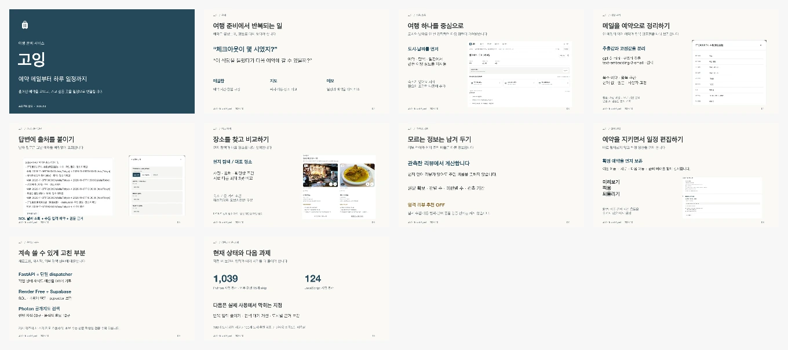

# 고잉 수업 발표

> **최신 발표:** [기획 계기와 구현 방법을 소개하는 10분 발표](v8/README.md). 기존 디자인의 12장 구성입니다. 아래는 이전 발표 기록입니다.

**10장 · 8분 30초 목표.** 여행 준비의 불편함에서 시작해 실제 화면, 질문과 일정의 설계, 운영 중 고친 문제, 다음 과제로 이어집니다.

- [Keynote 다운로드](going-class-presentation.key?raw=1)
- [PowerPoint 다운로드](going-class-presentation.pptx?raw=1)
- [기본 대본·5분 축약·10분 시연·예상 질문](SCRIPT.md)
- [자료 출처·사진 라이선스](CREDITS.md)
- [재검증 기록](REVIEW.md) · [슬라이드 문안](slides-content.json)



## 발표할 때

Mac에서는 `.key`를 열고 **보기 → 발표자 메모 보기**를 선택합니다. 각 장의 대본과 화면을 가리킬 위치를 넣었습니다. 근거 링크와 기술 표기는 ‘낭독하지 않음’ 아래에 있습니다. PPTX에도 같은 기본 대본을 넣었습니다.

이번 재검토에서 macOS Keynote의 **10장 모두**와 메모를 확인했습니다. 글꼴은 기존 Pretendard를 유지했고 텍스트를 개별 수정할 수 있습니다. 글꼴은 파일에 내장하지 않았습니다. 다른 PC의 PowerPoint·웹 슬라이드 앱·강의실 프로젝터에서는 별도로 열어 확인합니다.

8분 30초는 목표 배분이며 실제 낭독 측정값이 아닙니다. 한 번 소리 내어 연습하고 시간이 길면 세부 설명을 줄입니다. 5분 축약 대본과 60–90초 시연 구성은 [SCRIPT.md](SCRIPT.md)에 있습니다.

## 화면을 재현할 때

저장소 루트에서 실행합니다.

```bash
PYTHON_DOTENV_DISABLED=1 .venv/bin/python scripts/presentation_browser_fixture.py
```

`http://127.0.0.1:8766`에서 합성 사용자 A로 로그인합니다. 임시 DB에 가상 메일 3건·수동 예약 3건을 준비하고 기본 분석 후 예시 일정을 생성합니다. 유료 AI를 호출하거나 운영 인증을 바꾸는 스크립트가 아닙니다. 일정은 충돌·미확인 표시를 보여주는 예시입니다.

마드리드 화면은 출처가 있는 실제 식당 자료입니다. 사진은 촬영 시점의 상태이며 현재 메뉴·실내·예약 가능 여부를 보증하지 않습니다. 자료가 만료되면 재검수 전까지 결과가 줄거나 미확인으로 표시될 수 있습니다.

이번 작업은 발표·문서 수정입니다. 메일 분석이나 운영 서버를 다시 검증한 작업으로 기록하지 않았습니다. 과거 회귀 시험 수치와 이번 문서 검증은 [REVIEW.md](REVIEW.md)에서 구분합니다.
