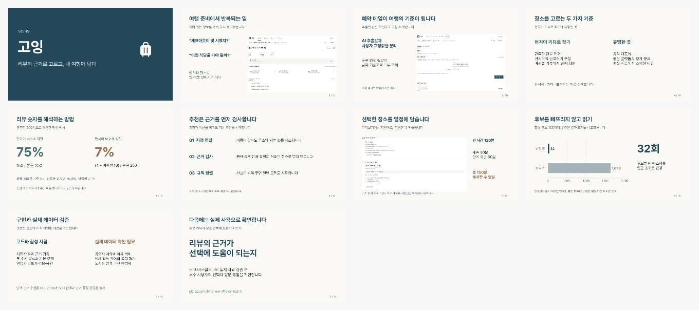

# 고잉 v4 수업 발표

**10장 · 목표 8분 30초.** 여행 준비의 불편함 → 예약 메일 → 두 추천 방식 → 원문 언어 계산 → 일정과 성능 → 실제 검증 과제로 이어집니다. 기술 용어를 읽기보다 사용자 경험을 설명하도록 작성했습니다.

- [Keynote 다운로드](going-v4-class-presentation.key?raw=1)
- [PowerPoint 다운로드](going-v4-class-presentation.pptx?raw=1)
- 발표 대본(로컬 별도 보관)
- [문안 원본](slides-content.json) · [검증 기록](REVIEW.md) · [출처](CREDITS.md)

## 사용 방법

Keynote에서 파일을 열고 **보기 → 발표자 메모 보기**를 선택합니다. 슬라이드별 대본·화면 안내가 들어 있습니다. `낭독하지 않음` 아래의 출처·검증 제한은 참고 정보입니다. PPTX에도 동일한 기본 메모를 넣었습니다.

Pretendard와 고잉의 남청색·회녹색을 사용했습니다. 글꼴은 내장하지 않았으므로 다른 컴퓨터에서는 설치된 글꼴과 줄바꿈을 확인합니다. macOS Keynote에서는 10장과 메모, 로고·차트를 실제로 확인했습니다. 다른 PC의 PowerPoint·Google Slides·강의실 프로젝터는 별도 확인이 필요합니다.

8분 30초는 목표 배분이며 실제 낭독 측정값은 아닙니다. 4·5·9장이 핵심입니다. 현지어 비중을 주민 비율로 표현하지 않고 **엄격 언어 추천은 실제 품질 검증 전 OFF**라는 부분은 축약해도 남깁니다.

이전 발표와 사용자가 수정 중이던 파일은 상위 폴더에 보존했습니다. 이번 파일은 새 이름·새 폴더입니다.
