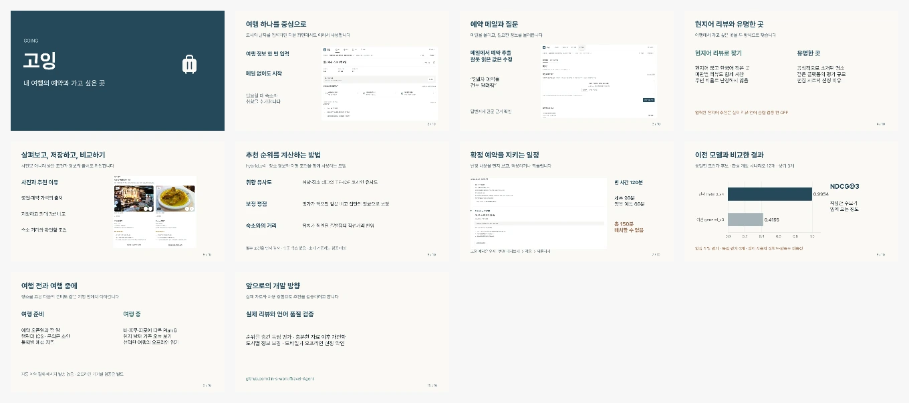

# 고잉 수업 발표

10장 · 목표 8분 30초. 여행과 음식점을 좋아해서 겪은 불편함으로 시작하고, 화면을 따라 주요 기능을 설명합니다. 추천 모델과 비교 결과는 두 장, 다음 개발 방향은 마지막 장에 담았습니다.

- [Keynote 다운로드](going-v5-class-presentation.key?raw=1)
- [PowerPoint 다운로드](going-v5-class-presentation.pptx?raw=1)
- 발표 대본(로컬 별도 보관)
- [슬라이드 문안](slides-content.json) · [화면·사진 출처](../CREDITS.md)

Keynote에서 **보기 → 발표자 메모 보기**를 선택하면 각 장의 대본과 화면 안내를 볼 수 있습니다. PPTX에도 같은 메모가 있습니다. Pretendard 글꼴은 내장하지 않았으므로 강의실 컴퓨터에서 열 경우 글꼴과 줄바꿈을 먼저 확인합니다.

모델 비교는 합성 개발 시나리오 12개 결과입니다. 실제 사용자 정확도·방문 만족도는 미측정이며, 엄격한 현지어 리뷰 추천은 실제 데이터 검증 전 OFF입니다. 이 부분은 5분으로 줄일 때도 유지합니다.

8분 30초는 시간 배분 목표입니다. 실제 말하는 속도에 맞춰 한 번 낭독하고 조정합니다. 이전 발표 파일과 기존 수업 PDF는 상위 폴더에 그대로 보관했습니다.
