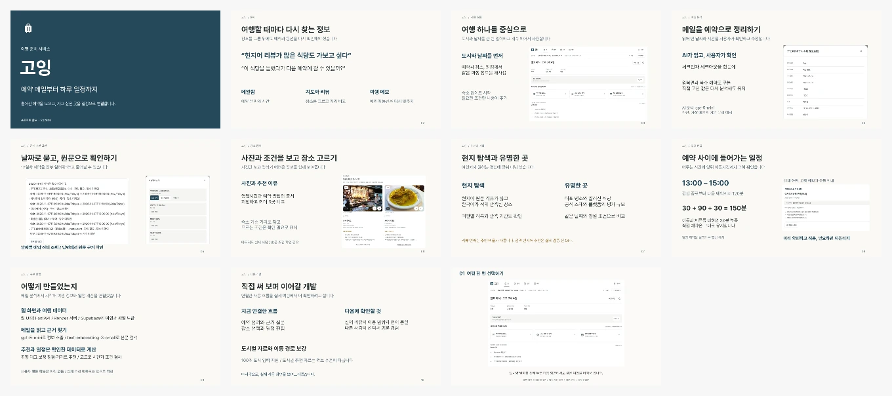

# 고잉 서비스 소개 발표

여행과 음식점 다니기를 좋아하지만 매번 검색하고 예약을 다시 찾는 과정이 불편해서 만들었습니다. 이 발표에서는 그 경험에서 출발해 고잉을 어떻게 기획했고, 어떤 기능을 연결했는지 소개합니다.

**11장, 데모 70초 포함 약 8분 30초.** 기존 발표의 남색 표지와 밝은 본문 디자인을 사용했습니다.

- [Keynote 다운로드](going-v6-class-presentation.key?raw=1)
- [PowerPoint 다운로드](going-v6-class-presentation.pptx?raw=1)
- [발표 대본과 5분 축약 안내](SCRIPT.md)
- [70초 데모 MP4](going-demo.mp4?raw=1)
- [화면·사진 출처](CREDITS.md)

## 발표 흐름

1. 여행에서 느낀 불편함과 서비스를 만든 계기
2. 여행 정보를 한 번 입력하고 이어서 쓰는 흐름
3. 메일을 예약으로 정리하고 질문의 근거 확인
4. 장소 사진과 조건 비교, 현지 탐색과 유명한 곳
5. 확정 예약을 지키는 일정과 편집
6. 웹·서버·AI·추천 계산을 어떻게 연결했는지
7. 앞으로의 개발 계획과 마지막 데모

추천 모델 수치 비교는 본문에서 빼고 대본의 예상 질문으로 옮겼습니다. 실제 사용자 만족도를 확인한 결과로 소개하지 않습니다.

## 발표 준비

Mac에서는 Keynote를 열고 **보기 > 발표자 메모 보기**에서 대본을 볼 수 있습니다. 마지막 장에서 재생을 시작하면 화면 캡처 데모를 보여줍니다. 영상은 파일 안에 포함되어 있으며, 별도 MP4도 백업용으로 제공합니다. 음악과 음성은 없으므로 영상의 자막이나 대본에 맞춰 설명하면 됩니다.

데모는 **2026-10-07의 실제 앱 화면 캡처를 편집한 영상**입니다. 합성 계정·가상 예약으로 촬영했고 메일은 기본 분석을 사용했습니다. 실시간 조작 영상이나 최신 추천 모델의 새 실행 기록은 아닙니다. 영상 속 일정에는 충돌과 미확인이 남아 있으며, 장소의 미래 영업·잔여석은 확인 필요 상태입니다.

발표 전 사용할 컴퓨터에서 파일을 한 번 열고 마지막 영상까지 재생해 보세요. 글꼴은 Pretendard이며 파일에 내장하지 않았습니다. PowerPoint와 강의실 장비의 영상 재생은 별도로 확인해야 합니다.

엄격 현지어 추천은 실제 리뷰 이용 범위와 언어 품질 검증 전 OFF입니다. 100개 도시 입력 지원과 도시별 추천 자료 확보 수준은 구분합니다. 이전 사용자 발표·PDF는 상위 폴더에 그대로 보존했습니다.
