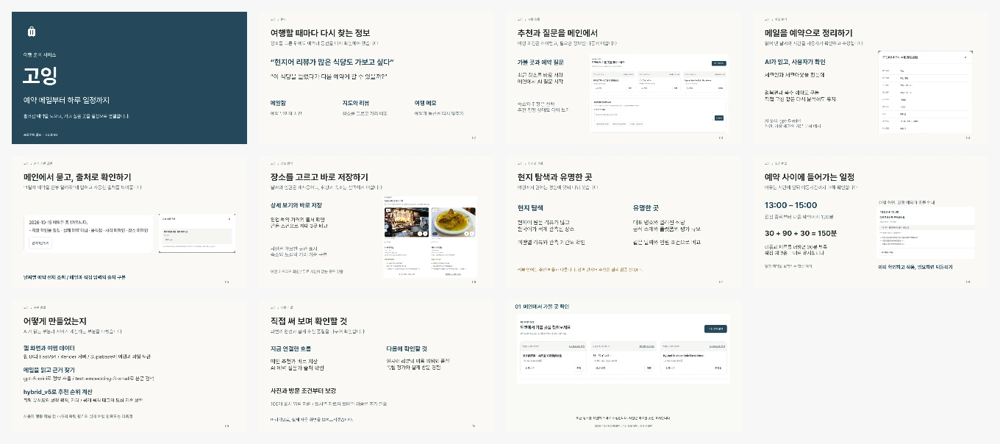

# 고잉 서비스 소개 발표

여행과 음식점 다니기를 좋아하지만 매번 장소를 찾고 예약을 다시 확인하는 과정이 번거로워 만들었습니다. 그 경험에서 출발해 고잉을 어떻게 기획했고 어떤 기능을 연결했는지 소개합니다.

**11장, 영상 70초 포함 약 8분 30초.** 기존 남색 표지, 밝은 본문, Pretendard 글꼴을 유지했습니다. 최신 메인 추천과 AI 질문, 저장·거리 기준, `hybrid_v5` 설명을 반영했습니다.

- [Keynote 다운로드](going-v7-class-presentation.key?raw=1)
- [PowerPoint 다운로드](going-v7-class-presentation.pptx?raw=1)
- 발표 대본(로컬 별도 보관)
- [70초 화면 영상](going-demo.mp4?raw=1)
- [화면·사진 출처](CREDITS.md)

## 발표 흐름

개인적인 불편함과 기획 계기를 소개한 뒤 메인 추천과 질문, 메일 정리, 장소 선택, 현지어 리뷰와 유명한 곳, 일정 편집을 설명합니다. 끝부분에서 구현 방법과 다음 개발 계획을 짚고 화면 영상을 보여줍니다. 이전 모델의 수치 비교는 대본의 예상 질문에 두었습니다.

## 발표 준비

Keynote에서 **보기 > 발표자 메모 보기**를 선택하면 장별 대본을 볼 수 있습니다. 마지막 장에는 70초 영상을 넣었고 별도 MP4도 제공합니다. 음악과 음성이 없으므로 대본의 시간별 멘트에 맞춰 설명하면 됩니다.

영상은 **실제 화면 캡처의 편집본**입니다. 메인·AI 질문·출처·도쿄 탐색은 2026-10-08 배포 화면의 가상 여행입니다. 메일·일정은 2026-10-07 로컬 합성 예시입니다. 실시간 클릭이나 분석 속도를 촬영한 영상은 아닙니다. 슬라이드 6의 마드리드 사진 화면도 이전 예시로 표시했습니다.

무료 사진이 없는 장소, 미확인 방문 조건, 실제 리뷰 품질 검증 전 OFF인 엄격 현지어 추천을 구분해서 설명합니다. v4의 합성 평가 수치를 현재 v5의 정확도로 사용하지 않습니다. 100개 도시 입력 지원도 모든 도시의 자료 확보를 뜻하지 않습니다.

글꼴은 파일에 내장하지 않았습니다. 강의실 장비와 PowerPoint에서 글꼴과 영상 재생을 한 번 확인해 주세요. 약 8분 30초는 목표 배분이며 실제 낭독 측정값은 아닙니다. [이전 발표](../v6/README.md)와 사용자 PDF는 보존했습니다.
