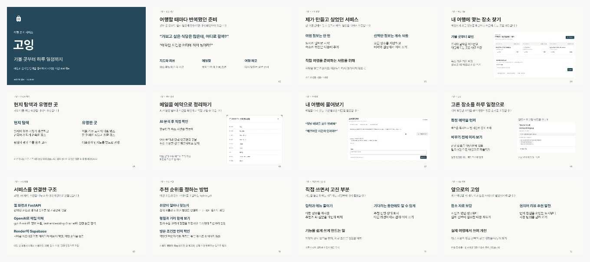

# 고잉 서비스 소개 발표

여행과 음식점 탐색을 좋아하는 개인적인 경험에서 출발해, 반복되던 준비 과정과 서비스 기획, 구현 방법을 소개합니다.

**12장, 약 10분 구성.** 기존 남색 표지와 밝은 본문, Pretendard 글꼴을 유지했습니다.

[Keynote](going-v8-class-presentation.key?raw=1) · [PowerPoint](going-v8-class-presentation.pptx?raw=1)

기획 계기와 사용자 문제를 설명한 뒤 장소 추천, 현지 탐색과 유명한 곳, 메일 정리, AI 대화와 일정을 소개합니다. 이어서 FastAPI·OpenAI·Render·Supabase의 역할과 추천 순위를 계산하는 방식, 직접 사용하면서 바꾼 점을 이야기합니다.

GitHub에는 발표 화면만 공유합니다. 대본과 발표자 메모는 로컬 원본에 별도로 보관합니다.
