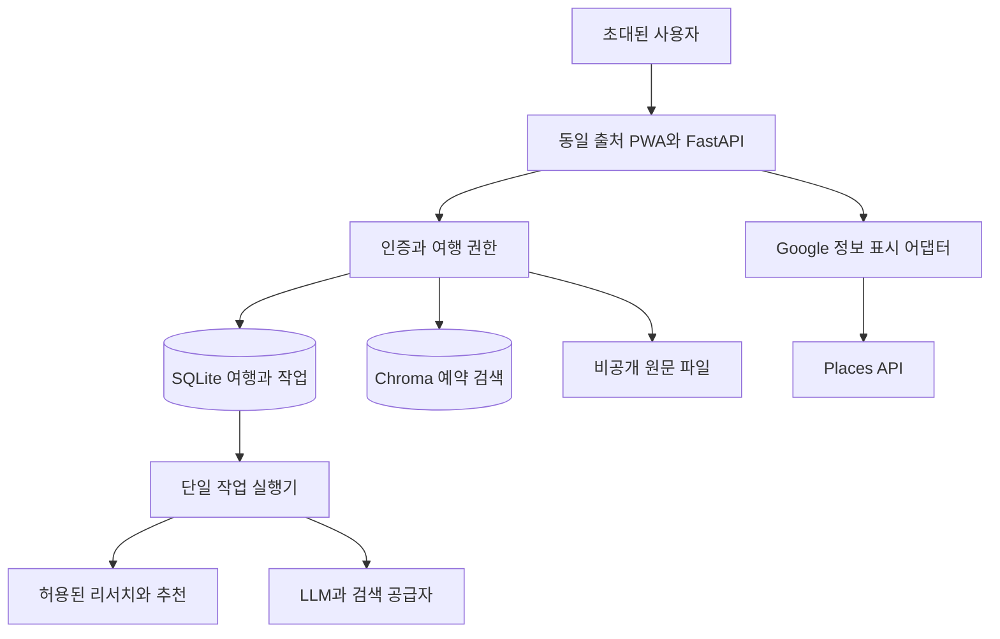

> **2026-10-06 적용 변경:** 사용자가 기존 Render Free + Supabase Free(`hii`)를 선택했다. 운영 DB는 PostgreSQL, 원문은 private Storage, 검색은 pgvector로 전환한다. 아래 SQLite/Chroma/영구 VM 설명은 로컬 모드와 이전 설계 이력이다. 현재 배포·비용·백업 계약은 [전환 안내](../operations/RENDER_SUPABASE.md)를 우선 적용한다. 새 버전 실제 배포는 별도 검증 상태다.

# Travel Agent 데이터와 운영 검토

2026년 10월 1일 기준으로 로컬 코드와 공식 문서를 검토하고 크롤링 조사 결과를 반영했습니다. 사용자 요구는 소수 지인용 비공개 베타, 낮은 비용, 일본 또는 바르셀로나 여행 지원입니다. **기존 FastAPI를 유지하면서 데이터와 권한을 정리하는 경로가 초기 변경량과 비용을 줄입니다.** 요금·제공 기능·약관은 실제 도입 전에 다시 확인합니다.

공식 Places API의 리뷰 5개 한도는 브라우저·별도 수집 도구의 기술적 한도가 아닙니다. 5개 초과 수집을 문서화한 공급자와 비용·한계는 [크롤링 조사](CRAWLING_FEASIBILITY.md), 수집한 최근 범위의 언어 집계는 [리뷰 데이터 명세](REVIEW_DATA_SPEC.md)를 따릅니다. API만으로 불가능하다는 이유로 크롤링 검증을 제외하지 않습니다.

## 현재 프로젝트에서 유지할 부분

예약 메일 로더·구조화 파서, 내용 해시, 날짜 교집합 검색, 근거가 없을 때 답을 생성하지 않는 RAG, 출처 표시와 진행 이벤트는 재사용합니다. PWA는 앱 셸만 캐시하고 API 응답을 캐시하지 않으므로 개인 예약이 오래된 캐시로 표시되는 문제를 줄입니다.

현재 기준은 로컬 `main`의 `aefee57`이며 origin은 [Travel Agent 저장소](https://github.com/Jin-s-work/Travel-Agent)와 일치합니다. 민감한 `.env`와 실제 사용자 메일은 검토하지 않았습니다.

## 코드에서 확인한 개선 과제

줄 번호는 검토한 커밋 기준입니다. 아래의 재현 여부는 외부 서비스에 대한 공격이나 실제 사용자 장애를 의미하지 않습니다.

| 우선순위 | 파일과 위치 | 확인한 내용 | 필요한 변경 |
| --- | --- | --- | --- |
| P0 | `api.py:165,353,406` | 전체 예약 조회·업로드·전체 삭제에 인증과 여행 범위가 없음 | 인증 세션, 소유권 검사, 여행별 API, 구 API 보호 |
| P0 | `api.py:108,242`, `src/agent.py:274` | history에 system 역할 입력이 스키마 검증을 통과하고 에이전트에 전달됨 | user/assistant만 허용, 총 길이 제한. 실제 지시 우회 성공은 미시험 |
| P1 | `src/indexer.py:68–79` | 기존 청크를 지운 뒤 임베딩. 임베딩 실패 전 삭제됨을 mock으로 재현 | 새 버전 준비 후 전환, 실패 시 기존 활성 버전 보존 |
| P1 | `api.py:181–210` | 절대 날짜의 하루 전체 질문이 빠른 의미 검색으로 분류됨을 재현 | 날짜 의도 우선 정규화, 하루 전체는 범위 조회. 실제 응답 누락 여부는 별도 평가 |
| P1 | `src/agent.py:62,173` | 출처 목록과 여행 시작일이 전역 변수 | 요청별 출처, DB의 여행별 설정. 실제 동시 요청 혼선은 미재현 위험 |
| P1 | `api.py:68–81,332–395` | 작업 상태가 메모리에만 존재, 접수와 상태 변경 사이 경쟁 가능 | 영구 Job, 원자 접수, lease, 재시도, 삭제와 취소 연동 |
| P1 | `src/parser.py:16–25,104` | 문자열 날짜·시각과 첫 구간 중심 추출 | 시간대가 있는 이벤트 모델, 복수 구간·사용자 수정 |
| P1 | `render.yaml:8`, `src/config.py:18` | 무료 플랜, 영구 디스크 미설정 | 유료 compute와 영구 경로, 사용자 모드 시드 OFF |
| P2 | `api.py:160` | health가 고정 성공만 반환 | 생존·준비 상태 분리, 저장소와 DB 검사 |
| P2 | requirements와 API 입구 | 의존성 고정 부족, 사용자 비용·업로드 총량 제한 없음 | 재현 가능한 설치, CI, 파일 수·총량·호출 예산 |

기존 테스트는 Python 3.13.5에서 **117개 통과**했습니다. dotenv 자동 로딩을 끄고 dummy API key, 시드 OFF, 기존 임시 저장 경로를 사용했습니다. 외부 LLM·Google API·배포 환경은 이 결과로 검증되지 않습니다. httpx 관련 TestClient deprecation warning 1개가 있습니다.

## Google 데이터의 역할과 한계

| 데이터 | 사용할 수 있는 정보 | 해석 제한 |
| --- | --- | --- |
| `rating`, `userRatingCount` | 평점과 전체 평가 수 | 텍스트 없는 별점도 포함하므로 언어 통계 분모가 아님 |
| `reviews` | 관련도순 최대 5개 | 전체 리뷰·언어별 총수·주민 여부를 제공하지 않음 |
| `originalText.languageCode` | 반환된 리뷰의 원문 언어 | 번역된 text 언어와 구분, 거주지 추정 금지 |
| `currentOpeningHours` | 오늘을 포함한 7일 운영 정보 | 다음 달 방문 가능 여부를 확인한 값이 아님 |
| `reservable`, `goodForGroups` | 예약 제공·단체 적합 여부 | 실제 시간대 재고와 숫자 인원 제한이 아님 |

근거: [Place 자료형](https://developers.google.com/maps/documentation/places/web-service/reference/rest/v1/places).

요청 `languageCode`는 표시 언어뿐 아니라 선택·순서에 영향을 줄 수 있습니다. 언어를 바꿔 여러 번 조회해 얻은 리뷰도 무작위 표본이 아닙니다. New API에 Legacy의 리뷰 정렬 파라미터를 섞지 않습니다. [Place Details New](https://developers.google.com/maps/documentation/places/web-service/place-details)

Google Business Profile 리뷰 목록 API는 권한이 있는 검증 사업장을 관리하기 위한 기능입니다. 일반 여행 앱이 모든 음식점 리뷰를 페이지 단위로 수집하는 대안으로 쓰지 않습니다. [Business Profile reviews list](https://developers.google.com/my-business/reference/rest/v4/accounts.locations.reviews/list)

Text Search의 `minRating`은 0.5 단위라 4.2를 넣으면 4.5로 올림됩니다. `openNow`는 조회 시점 기준입니다. 따라서 이를 각각 “4.2 이상”과 “여행 당일 영업” 필터로 표시하지 않습니다. [Text Search New](https://developers.google.com/maps/documentation/places/web-service/text-search)

## 데이터 이용 경계

Maps Platform API 계약에는 스크래핑·캐싱·파생 콘텐츠 생성·검색 결과 변경과 관련된 제한이 있습니다. **API 사용 권한이 있다는 이유만으로 리뷰를 DB·벡터 인덱스에 저장하고 자체 점수·LLM 입력에 쓰는 설계는 확정하지 않습니다.** 서비스별 예외, 실제 계정 계약과 사용 방식을 검토할 항목입니다. [Google Maps Platform 약관 3.2.3](https://cloud.google.com/maps-platform/terms)

Google Maps 웹·앱에는 별도의 소비자 추가약관이 적용됩니다. 브라우저 수집을 API 계약만으로 판단하거나 수집업체 결제를 콘텐츠 이용 허가로 취급하지 않습니다. 소비자 약관, 실제 접근 경로, 공급자가 가진 권리와 예정된 저장·분석·표시 범위를 구분합니다. [Maps 소비자 추가약관](https://www.google.com/help/terms_maps/)

초기 구조는 다음과 같습니다.

| 계층 | 원천 | 보관과 사용 |
| --- | --- | --- |
| 개인 여행 | 사용자 입력·예약 문서 | 접근 통제, 삭제 가능. 계약에 맞는 모델 처리 |
| 자체 장소 근거 | 직접 확인, 사용 가능한 공식 사실·편집 자료 | 허용된 최소 사실·출처·확인 시각만 저장, 원문 통째 복제 금지 |
| Google 표시 | Places API | 필요한 순간 조회하고 표시 요건 적용. 일반 로그·벡터·리서치 캐시로 보내지 않음 |
| 외부 ID | Google Place ID 등 | 공급자별 허용 조건 적용. Google Place ID는 장기 보관 가능 |
| 리뷰 언어 통계 | 향후 계약 데이터 | 통계 생성·저장·표시 권한과 표본 품질 확인 후 별도 기능으로 연결 |

Places 위경도의 최대 30일 임시 캐싱 예외는 리뷰·장소명·평점 전체의 보관 허가가 아닙니다. 첫 구현은 공급자 응답을 기본적으로 비영구 처리하고, 정책 레지스트리에서 허용된 필드만 별도 보관합니다. 여행 항목에는 내부 장소 ID, 사용자 선택과 자체 확인 정보, 허용된 외부 ID를 남깁니다. [서비스별 약관 14](https://cloud.google.com/maps-platform/terms/maps-service-terms), [Places 정책](https://developers.google.com/maps/documentation/places/web-service/policies)

Places 정보를 지도 위에 표시하는 경우 Google Map 요건을 따르고, 지도 없는 목록도 Google 표시를 해야 합니다. 리뷰·사진을 쓰면 작성자·링크 등 해당 콘텐츠의 표시 조건도 구현합니다. 초기에는 사진·리뷰 원문을 제외해 비용과 표시 복잡도를 줄입니다. [Places 표시 정책](https://developers.google.com/maps/documentation/places/web-service/policies)

정책 레지스트리에는 `provider`, `allowed_fields`, `storage_mode`, `expires_at`, `llm_allowed`, `ranking_allowed`, `attribution_requirements`, `policy_checked_at`을 둡니다. 정책이 불명확한 기능은 비활성 상태로 남기고 저장 일정·자체 추천은 계속 동작하게 합니다.

### Maps Grounding Lite 선택지

Google에는 LLM 연결을 위한 Maps Grounding Lite가 있으며 장소, 날씨, 도보·자동차 이동 정보를 다룹니다. 일반 Places를 그대로 LLM에 넣는 것과 구별되는 경로입니다. 전체 리뷰 언어 통계 문제를 해결하지는 않습니다. [Grounding Lite](https://developers.google.com/maps/ai/grounding-lite)

이 경로도 출처 표시, 모델의 입력 보관·학습 조건, 출력 수정·혼합과 보관 제한을 검토해야 합니다. 30일 출력 보관 예외를 일반 일정의 영구 저장 허가로 해석하지 않습니다. 초기 버전의 필수 의존성으로 넣지 않고 별도 실험으로 둡니다. [서비스별 약관 10](https://cloud.google.com/maps-platform/terms/maps-service-terms)

## 리뷰 언어 기능의 도입 판정

2~3작업일의 데이터 검증 단계에서 다음 질문에 답합니다.

1. 임의 장소에 대해 충분한 원문 리뷰 또는 검증된 언어 집계를 공급하는가?
2. 수집·분석·저장·상업 표시를 실제 계약과 출처 정책이 허용하는가?
3. 최신순 관측 구간·관측 기간·부분 실패·언어 미판별을 구분하는가? 전체 비율 추정을 원하는 경우는 전수 또는 적합한 표본 설계도 확인하는가?
4. 같은 지점을 정확히 연결하고 도시별 언어 집합을 다룰 수 있는가?
5. 초기 비용 범위에서 도쿄·바르셀로나에 필요한 커버리지가 나오는가?

수집 실험은 초기 개발과 병행합니다. 수집이 되고 이용·품질 조건도 통과하면 `observed_window` 기능을 첫 베타에 연결합니다. 조건을 충족하지 못하면 `review_language_filter=false`와 구체적인 부족 사유를 표시합니다. 원문·분모가 불명확한 자료를 긁어온 양만으로 제품 활성화를 결정하지 않습니다.

언어 통계의 분모는 실제 원문 분석 범위로 정의합니다. 판별 불가와 혼합 언어 규칙을 고정하고, 제외한 수와 비율을 함께 표시합니다. 표본 수가 크더라도 관광객 중심 플랫폼이라는 편향과 언어·거주지 차이는 남습니다.

## 낮은 비용으로 상시 운영하기

Render 무료 웹 서비스는 15분 무접속 후 휴면하고 로컬 파일이 영구 보존되지 않습니다. 유료 compute는 휴면하지 않지만 **유료 플랜만 선택하고 디스크를 연결하지 않으면 파일 영속성이 해결되지 않습니다.** [Render 무료 제한](https://render.com/docs/free), [Render FAQ](https://render.com/docs/faq)

권장 첫 구조는 다음과 같습니다.

영구 디스크의 `/var/data` 아래에 SQLite, Chroma와 원문을 각각 분리합니다. SQLite WAL, 짧은 트랜잭션, 단일 작업 실행기와 한 웹 프로세스로 시작합니다. DB Job을 원자적으로 가져오고 lease 만료 작업을 재개합니다. LLM 외부 호출 자체의 exactly-once 과금은 보장하지 않으며, 내부 중복 요청과 재시도 횟수를 제한합니다.

디스크는 한 서비스 인스턴스만 공유할 수 있고 디스크 부착 서비스는 무중단 배포에 제약이 있습니다. 초기 목표는 PC를 꺼도 접속 가능한 서비스이며, 무중단이나 SLA 보장이 아닙니다. [Render 영구 디스크](https://render.com/docs/disks)

저장된 여행을 읽는 경로와 비용이 드는 리서치 경로를 분리합니다. SQLite 쓰기 경합, 메모리 초과, 둘 이상의 웹 인스턴스 필요가 관측되면 PostgreSQL과 객체 저장소로 이동합니다. 관리형 DB·Redis·별도 워커를 첫날부터 모두 추가하지 않습니다.

### Sites 비교

| 선택 | 장점 | 이번 권고 |
| --- | --- | --- |
| 현재 FastAPI + Render 유료·디스크 | 기존 Python·Chroma 재사용, 한 출처 인증 | 가장 먼저 적용 |
| Sites 화면 + Render API | 화면 개발·공유 경로 선택 가능 | 화면 개편이 필요해지면 비교. API 비용은 유지 |
| Sites 전체 이전 | JS/TS·Workers와 D1/R2 중심으로 재구성 가능 | 현 Python 컨테이너를 그대로 이전하는 방식이 아니어서 초기 보류 |

Sites 공식 문서는 public beta와 플랜별 사용량 제한, 일부 백그라운드 기능·호스팅 패턴 제한을 설명합니다. 상시 무료·무제한 서버로 가정하지 않습니다. 화면을 나누면 인증 전달, CORS와 외부 API 권한 검증을 추가로 설계해야 합니다. [Sites 공식 문서](https://learn.chatgpt.com/docs/sites), [JS와 TS 앱 안내](https://learn.chatgpt.com/use-cases/build-and-deploy-internal-apps)

## 비용 계산과 차단 기준

아래 금액은 2026년 10월 1일에 확인한 공개 USD 단가입니다. 실제 결제는 세금·환율·지역·계정별 조건·초과 트래픽의 영향을 받습니다. 현재 과금 계정이나 사용량은 조사하지 않았습니다.

| 인프라 | 월 예시 |
| --- | ---: |
| 512MB 웹 compute + 1GB 디스크 | $7 + $0.25 = $7.25 |
| 2GB 웹 compute + 1GB 디스크 | $25 + $0.25 = $25.25 |

출처: [Render 가격표](https://render.com/pricing), [compute plan 명칭](https://render.com/docs/compute-plans). 플랜 이름은 배포 시 현재 스키마를 확인합니다. **512MB에서 Chroma·LangChain·웹·작업을 함께 돌릴 수 있는지는 실측해야 합니다.** 먼저 지연 로딩·동시 작업 제한·의존성 정리를 검증하고, 부족하면 추가 요금과 기능 축소를 비교합니다.

Google 글로벌 종량제의 월 SKU별 무료량 및 무료량 초과 후 첫 구간은 다음과 같습니다.

| SKU | 월 무료량 | 이후 1,000회 |
| --- | ---: | ---: |
| Text Search Pro | 5,000 | $32 |
| Text Search Enterprise | 1,000 | $35 |
| Place Details Enterprise | 1,000 | $20 |
| Place Details Enterprise + Atmosphere | 1,000 | $25 |

출처: [Google 가격표](https://developers.google.com/maps/billing-and-pricing/pricing). 무료량은 앱의 사용자별 권리가 아니라 해당 과금 집계 범위에서 소비되는 SKU별 한도입니다. 다른 프로젝트·앱의 사용도 계정 조건에 따라 영향을 줄 수 있으므로 새 앱의 호출 수만으로 잔여 무료량을 단정하지 않습니다.

요청 필드 중 높은 SKU가 과금에 영향을 줍니다. 평점·평가 수·영업시간·공식 사이트는 Enterprise, 리뷰·예약 제공·단체 적합성은 Enterprise + Atmosphere에 해당합니다. `FieldMask: *`를 쓰지 않고 필요한 필드를 요청 단계별로 나눕니다. [필드별 SKU](https://developers.google.com/maps/documentation/places/web-service/data-fields), [SKU 규칙](https://developers.google.com/maps/billing-and-pricing/sku-details)

예를 들어 한 달 추천 세션 100회, 세션당 Enterprise 검색 2회와 Enterprise 상세 5회라면 각각 200·500회입니다. 이 두 SKU의 무료량이 충분히 남아 있다는 가정에서 해당 Places 비용은 $0입니다. 무료량을 무시한 첫 구간 단가로는 `200×0.035 + 500×0.020 = $17`입니다. 재시도·페이지 추가·다른 필드·지도·LLM 비용은 별도입니다. 실제 첫 버전은 자체 후보를 재사용하고 상세 페이지를 열 때만 필요한 정보를 조회해 호출 수를 줄입니다.

제안 초기 예산은 인프라 $7.25부터, AI·검색 합산 월 $5의 앱 내부 한도입니다. Google 유료 구간 진입은 기본 차단합니다. **리뷰 수집은 별도 비용 항목**이며 실험 A·B 합산 $3 상한을 제안합니다. 이후 30곳×200레코드 운영 후보팩 비용과 공급자 최소 결제·크레딧은 [크롤링 비용표](CRAWLING_FEASIBILITY.md)를 확인합니다. LLM·Tavily 요금은 도입 계정과 모델의 최신 단가를 확인해 ledger에 등록하고, 단가가 없는 공급자는 활성화하지 않습니다. 이 예산은 사용자에게 확정받은 금액이 아닙니다.

내부 ledger는 호출 전 예상 비용을 원자적으로 예약하고, 응답 뒤 실제 usage로 정산합니다. 월말·시간대, 재시도와 동시 요청도 한도에 반영합니다. 공급자 청구 지연이나 외부에서 발생한 사용을 완전히 막는 수단은 아니므로 공급자 quota와 결제 알림을 함께 설정합니다. 한도 도달 시 추가 연구를 중단하고 저장된 예약·일정은 계속 보여줍니다.

Routes Matrix는 출발지 수 × 도착지 수의 요소 단위 과금입니다. 후보 20개 전 조합은 400요소이므로 먼저 지역별 후보를 줄입니다. 초기에는 외부 지도 링크와 허용된 이동 추정으로 시작하고 정밀 경로는 이후 연결할 수 있습니다. [Routes 사용량과 과금](https://developers.google.com/maps/documentation/routes/usage-and-billing)

## 배포와 복구 확인

1. 운영 환경에서 데모 시드를 끄고 초대 인증·권한 검사를 적용합니다.
2. 영구 경로와 컨테이너 비루트 계정의 쓰기 권한을 확인합니다.
3. 기존 데이터는 소유자를 지정해 이관합니다. 출처·소유자 불명인 전역 자료는 임의 계정에 배정하지 않습니다.
4. 30분 미접속, 프로세스 재시작, 재배포 후 여행과 작업 상태를 확인합니다.
5. DB의 일관된 백업을 만들고 별도 환경에 복원합니다. Chroma는 허용된 원본에서 재생성 가능한 파생물로 둡니다.
6. 단일 디스크 장애에 대비해 암호화한 외부 백업을 준비하고 저장 위치·복원 책임·비용을 문서화합니다. 디스크 스냅샷만으로 복원 성공을 가정하지 않습니다.
7. 초기 목표는 24시간 이내 데이터 손실 범위와 4시간 이내 복구입니다. 백업 보관 7일은 제안 값이며 실제 복원 훈련 후 조정합니다.
8. 기존 삭제 기록은 복원 후에도 재적용합니다. 삭제한 메일이 남은 백업에서 복원될 수 있는 기간을 사용자에게 안내합니다.

이번 검토에서는 실제 유료 서비스 생성, 공급자 키 발급, 외부 데이터 수집 계약, 운영 배포를 수행하지 않았습니다.
