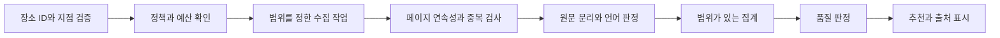

# 리뷰 수집과 언어 신호 설계

이 문서는 음식점의 원문 리뷰 언어를 이용하는 기능의 데이터 계약입니다. **크롤링은 공식 Places API의 5개 제한을 넘어 리뷰를 확보할 수 있는 기술적 선택지**입니다. 실제 수집 성공률과 이용 조건은 [크롤링 조사](CRAWLING_FEASIBILITY.md)의 실험을 통과해야 합니다. 이 문서의 숫자는 제품 검증용 기본값이며 실제 조사 결과가 아닙니다.

## 기능의 의미

사용자가 원하는 조건은 현지어 리뷰가 많고 한국어 리뷰가 적으면서 평점과 리뷰 규모가 충분한 장소입니다. 이 기능은 다음 두 가지 모드로 나눕니다.

| 모드 | 질문 | 표시와 적용 |
| --- | --- | --- |
| `observed_window` | 이번에 실제로 확보한 최근 리뷰에서 어떤 언어가 보이는가 | 수집 범위가 검증되면 해당 범위의 비중을 표시하고 탐색 신호로 사용 |
| `population_estimate` | 장소 전체 리뷰의 언어 구성은 어떠한가 | 전수 또는 추정에 적합한 표본 설계가 확인됐을 때만 활성화 |

처음 구현할 것은 `observed_window`입니다. 최신순 자료도 **관측한 범위에 대한 기술통계**는 계산할 수 있습니다. 다만 그 비중을 장소 전체나 주민 방문 비율로 일반화하지 않습니다. 기존 기획의 대표성 조건은 `population_estimate`에 적용합니다.

언어 신호는 사람을 배제하는 필터가 아니라 여행자가 원하는 분위기를 찾는 보조 지표입니다. UI 이름은 `최근 리뷰 언어`, 선택 설명은 `현지어 비중이 높고 한국어 비중이 낮은 후보를 우선`으로 둡니다. “한국인이 없는 곳”이라는 분류는 만들지 않습니다.

## 관측 범위 정의

초기 실행 설정은 아래와 같습니다.

```json
{
  "collection_mode": "observed_window",
  "sort": "newest",
  "lookback_days": 180,
  "max_review_records": 200,
  "max_pages": 20,
  "max_attempts_per_page": 2,
  "min_classified_texts": 100,
  "max_unknown_share": 0.10,
  "local_share_min": 0.60,
  "korean_share_max": 0.10,
  "max_total_cost_usd": 3.00,
  "locale_filter": null,
  "keyword_filter": null,
  "rating_filter": null
}
```

`max_total_cost_usd`는 **한 실험 전체의 제안 상한**입니다. 실제 공급자의 최소 결제액이 더 크면 이 설정으로 실행할 수 없습니다. 장소별 상한으로 해석하지 않습니다. 월 운영 예산과도 별도입니다.

리뷰 레코드 200건에는 본문 없는 별점 평가가 포함될 수 있습니다. 텍스트 200개를 얻을 때까지 끝없이 더 수집하지 않습니다. 180일 경계, 레코드 수, 페이지 수, 비용·시간 상한 중 하나에 도달하면 종료합니다.

정상 종료 범위는 다음 중 하나입니다.

- `exhausted`: 공급자가 다음 페이지가 없다고 응답했음. 플랫폼 전체 전수를 보장하는 뜻은 아님.
- `date_boundary`: 시간 순서와 페이지 연결을 확인했고 관측 시작일 이전에 도달함.
- `record_cap`: 공급자가 최신순으로 반환한 첫 K개를 중복 제거 후 확보했고 페이지 연결에 확인된 누락이 없음. 플랫폼 전체의 최신 K개 완전 수집을 뜻하지 않음.

`page_cap`, `time_cap`, `budget_cap`, `provider_blocked`, `cursor_expired`, `parse_error`는 **부분 수집**입니다. 정상 완료처럼 표시하지 않습니다. 공급자가 일부만 돌려주는 경우도 `partial`이며 반환 개수만으로 전수라고 판정하지 않습니다.

정렬 기준은 `published_at`, `edited_at`, `unknown`으로 구분합니다. 가능하면 발행 시각 기준을 사용하지만 수정 시각 정렬이 확인되면 그 사실대로 기록합니다. 날짜 경계는 정렬과 동일한 시간 기준에서만 판정합니다. 기준이 불명확하면 기간의 완결성을 주장하거나 엄격 배지를 부여하지 않습니다.

## 최소 데이터 계약

공통 스키마에는 공급자 원문 응답을 그대로 넣지 않습니다. 아래 필드는 이용 가능 범위에서만 보관합니다. 권한이 없는 데이터는 메모리 처리도 자동 허용된 것으로 간주하지 않습니다.

| 엔터티 | 필드 |
| --- | --- |
| `ReviewCollectionRun` | run_id, provider, adapter_version, place_identity_id, external_place_id, policy_version, input_hash, sort, website_locale, started_at, finished_at, cost_actual |
| 수집 범위 | requested_start, requested_end, observed_oldest_at, observed_newest_at, requested_limit, fetched_count, unique_count, stop_reason, continuity_status, ordering_semantics |
| `ReviewObservation` | provider_review_id 또는 허용된 dedupe_key, place_id, original_text_ref, original_language, translated_text_present, published_at, edited_at, rating |
| 언어 판정 | language, detector_version, model_confidence, text_status, disagreement_reason, classification_checked_at |
| `ReviewAggregate` | total_rating_count, observed_records, text_count, classified_count, unknown_count, counts_by_language, scope_mode, inference_method, computed_at, expires_at |

`total_rating_count`는 본문 없는 별점도 포함할 수 있는 플랫폼의 전체 평가 수입니다. `text_count`는 이번 관측에서 본문을 확보한 수입니다. 둘은 언어 비율의 같은 분모가 아닙니다.

리뷰 작성자 이름·프로필 사진·프로필 URL·방문 이력·다른 장소의 리뷰는 추천에 필요하지 않으므로 정규화 결과에 포함하지 않습니다. Google Local Guide 배지를 거주자 판정에 사용하지 않습니다.

원문 보관 기간은 `min(권한상 허용 기간, 제품 필요 기간)`으로 정합니다. 명시된 권한이 없으면 임의의 7일·30일 보관을 허용하지 않습니다. 집계값·dedupe ID도 무조건 자유롭게 보관 가능한 것으로 가정하지 않습니다. 권한·삭제 정책은 원문과 집계를 각각 정의합니다.

## 원문과 번역 구분

수집 어댑터는 다음 상태를 반환합니다.

| 상태 | 처리 |
| --- | --- |
| 원문 텍스트와 원문 언어 모두 제공 | 교차 검증 후 분류 |
| 원문 텍스트만 제공 | 로컬 언어 판별기로 분류 |
| 원문 없이 번역문만 제공 | 언어 통계에서 unknown |
| 원문·번역문이 합쳐져 있음 | 구조적으로 분리 가능할 때만 원문 사용 |
| 본문 없이 별점만 있음이 확인됨 | text_count에서 제외, rating_only_count 별도 |
| 본문 존재 여부 또는 추출 성공 여부가 불명 | extraction_unknown_count 별도, 엄격 필터 차단 |
| 이모지·메뉴명·매우 짧은 문장 | 판별 기준 미달이면 unknown |

웹사이트의 `language` 또는 `hl` 파라미터는 사용자의 표시 언어일 수 있습니다. 이를 리뷰 원문 언어로 복사하지 않습니다. 번역된 한국어를 한국어 원문 리뷰로 세지 않습니다. 본문을 놓친 파서를 별점-only로 처리하지 않습니다. 번역문만 있어 본문 존재는 확인되면 T와 U에 포함하고, 본문 존재조차 모르면 별도 추출 실패 상태를 유지합니다.

도쿄의 초기 현지어 집합은 `ja`, 바르셀로나는 `es, ca`입니다. BCP 47 태그 원본을 남기고 집계 시 기본 언어로 정규화합니다. `es-419`도 스페인어로 집계하되 바르셀로나 주민을 의미하지 않습니다. 여러 언어가 실질적으로 섞인 본문은 초기에는 unknown으로 두고 분할 집계를 별도 기능으로 미룹니다.

언어 판별은 저렴한 로컬 모델부터 평가합니다. 예를 들어 fastText의 `lid.176.ftz`는 176개 언어와 압축 모델을 제공하지만, 짧은 음식점 리뷰나 스페인어·카탈루냐어 구별 정확도를 보장하지 않습니다. 모델 배포 라이선스도 확인해야 합니다. [fastText 공식 모델 안내](https://fasttext.cc/docs/en/language-identification)

모든 리뷰를 LLM으로 분류하지 않습니다. 허용된 원문에서 지역별 검증셋을 만들고, 로컬 모델이 확신하지 못한 항목은 unknown으로 남기는 방식부터 시작합니다. confidence는 모델 점수이며 맞을 확률이나 주민일 확률로 표시하지 않습니다.

## 언어 집계 공식

중복 제거한 관측 레코드 중 본문이 있는 수를 `T`, 언어를 판별한 수를 `C`, 미판별 수를 `U`로 둡니다. `T = C + U`입니다. 현지어 수는 `L`, 한국어 수는 `K`이고 `L + K ≤ C`입니다.

```text
classified_local_share = L / C
classified_korean_share = K / C
unknown_share = U / T

local_share_lower_bound = L / T
local_share_upper_bound = (L + U) / T
korean_share_lower_bound = K / T
korean_share_upper_bound = (K + U) / T
```

분모가 0이면 결과는 null입니다. 위 상하한은 **미판별 항목이 어느 언어일지 모르는 범위**이며 통계적 95% 신뢰구간이 아닙니다. 분류가 완료된 항목의 오류까지 보정하는 것도 아닙니다.

`observed_window` 엄격 필터의 초기 조건은 다음과 같습니다.

1. 사용·계산·표시 권한과 지점 일치가 확인됨.
2. 공급자가 반환한 최신순 페이지 구간의 연속성이 검증되고 부분 실패·본문 추출 불명 항목이 없음. 플랫폼 자체의 완전성을 입증했다는 뜻은 아님.
3. `C ≥ 100`, `U/T ≤ 0.10`이며 언어 판별 평가 통과.
4. `L/T ≥ 0.60`, `(K+U)/T ≤ 0.10`.
5. 평점·전체 평가 수 조건은 같은 플랫폼의 이용 가능한 수치를 별도로 적용.

이 필터도 “최근 관측 범위”에만 적용됩니다. 관련도순 자료나 검색어로 고른 리뷰는 탐색 자료로 볼 수 있지만 엄격 필터에서 제외합니다. 최신순 정렬이 깨진 자료도 제외합니다.

완화 필터에서는 분류 가능한 리뷰의 비중을 보여줄 수 있으나 미판별 범위와 `탐색 참고`를 함께 표시하고 엄격 통과 배지를 붙이지 않습니다. 알고리즘이 부족한 근거를 조용히 보충하지 않습니다.

## 계산 예시

다음은 실제 식당과 관계없는 합성 데이터입니다. 모두 지점과 사용 권한, 수집 방식 검증을 통과했다고 가정합니다.

| 예시 | T / C / U | L / K | 계산 | 판정 |
| --- | --- | --- | --- | --- |
| A | 200 / 190 / 10 | 150 / 4 | 분류 중 현지어 78.9%, 한국어 2.1%; 보수적 현지어 75%, 한국어 최대 7% | 최근 관측 엄격 조건 통과 |
| B | 200 / 130 / 70 | 120 / 0 | 한국어 0건이어도 미판별 35%, 한국어 상한 35% | 자료 품질 미달 |
| C | 5 / 5 / 0 | 5 / 0 | 언어 표본 5개 | 자료량 미달 |
| D | 200 / 195 / 5 | 110 / 2 | 현지어 하한 55% | 현지어 조건 미달 |
| E | 200 / 195 / 5 | 150 / 18 | 한국어 상한 11.5% | 한국어 조건 미달 |

A의 UI는 `최근 확보한 텍스트 리뷰 200건 · 원문 언어 판별 190건 · 일본어 150건 · 한국어 4건 · 미판별 10건`입니다. 필요한 경우 `판별 가능한 리뷰 중 일본어 78.9%`를 보조 표시합니다. `주민 78.9%` 또는 `전체 한국어 리뷰 2.1%`라고 하지 않습니다.

## 전체 비율 모드

전수라면 **확보한 전수의 범위와 시점**을 표시합니다. 플랫폼 평가 총수와 수집 텍스트 수가 다르므로 두 숫자가 다르다는 이유만으로 수집 누락률을 계산하지 않습니다.

모집단 추정은 실제 추출 설계가 필요합니다. 동일확률 무작위 표본으로 이항 근사가 적합할 때만 Wilson 등의 구간을 적용하고, 층화·가중·군집 표본은 그 설계에 맞는 방법을 검증합니다. 최신순 200건에 Wilson 구간을 붙여 전체를 대표하는 것처럼 만들지 않습니다. [NIST 비율 구간](https://www.itl.nist.gov/div898/handbook/prc/section2/prc241.htm)

## 추천 점수와의 연결

사용자가 `리뷰 언어 조건`을 켜면 조건과 근거 수준을 먼저 표시합니다. 데이터 없는 장소를 한국어 비중 0%로 간주하지 않습니다.

- 엄격 모드: 검증된 `observed_window` 통과 후보만 결과에 포함하고 범위를 표시.
- 탐색 모드: 언어 신호, 지역 편집 근거, 취향, 이동 부담을 별도 표시. 데이터 없는 후보도 근거 부족 상태로 볼 수 있음.
- 대표 명소 모드: 언어 조건 기본 OFF. 유명 장소를 원하는 목적에 맞게 대표성·취향·동선을 우선.

전체 평점의 비교는 같은 플랫폼·지역·업종 내에서 합니다. 4.2점·평가 200건은 파일럿 기본값입니다. 작은 식당을 살펴볼 수 있도록 사용자가 평점·평가 규모 필터를 완화할 수 있지만 앱은 자동 완화하지 않습니다.

리뷰 기반 수치가 unavailable 또는 만료되면 언어 점수를 0으로 주고 그대로 정렬하지 않습니다. 리뷰 기반 모델과 편집 근거 기반 모델의 결과를 별도 근거 수준으로 표시하고, 사용자가 엄격 조건을 고른 경우는 결과 부족을 반환합니다.

## 수집과 갱신 파이프라인



추천 버튼을 누를 때마다 크롤링하지 않습니다. 도시 후보팩을 준비하고 유효한 집계를 재사용합니다. 갱신은 명시된 보관·처리 권한과 비용 예산 안에서 실행합니다.

증분 갱신은 최신순 페이지에서 기존 리뷰 ID와 겹치는 구간까지 조회한 뒤 합칩니다. 기존 ID를 하나 만났다고 즉시 종료하지 않고 적어도 연속 페이지·중복 구간을 확인합니다. 정렬이 수정 시각 기준이면 오래된 리뷰가 앞으로 올 수 있으므로 날짜·수정값도 비교합니다.

새 리뷰만 추가하면 오래된 수정·삭제를 놓칠 수 있습니다. 제한된 정기 재대조를 별도 예산으로 두고 `last_full_reconciliation_at`을 기록합니다. 현재 페이지에 없다는 이유만으로 개별 리뷰를 삭제하지 않습니다. 공급자가 삭제를 확인하거나 정해진 범위를 완전 재수집했을 때만 반영합니다.

리뷰 ID가 없으면 정규화한 텍스트·평가·시각·지점을 바탕으로 중복 가능성을 검출하되 짧은 같은 문구 두 개를 자동으로 동일 리뷰로 확정하지 않습니다. 중복 키 충돌이 있으면 품질 상태를 낮춥니다. 해시도 익명화나 보관 허가를 자동으로 보장하지 않습니다.

## 첫 실험과 통과 조건

도쿄 5곳·바르셀로나 5곳, 음식점 중심의 10개 지점을 대상으로 최대 200레코드씩 비교하는 실험을 제안합니다. 실제 이름과 URL은 실행 시 확정하며 이 문서는 수집 완료를 뜻하지 않습니다.

| 검사 | 제안 판정 기준 |
| --- | --- |
| 식별 | 10곳 모두 지점·주소 일치, 모호하면 해당 지점 제외 |
| 반환량 | 100개 이상 리뷰가 공개된 후보 중 최소 8곳에서 5개 초과 원문 확보 |
| 페이지네이션 | 누락·반복 cursor 탐지, 중복 제거, 종료 사유 100% 기록 |
| 원문 보존 | 각 도시 수작업 검수 20건에서 번역문을 원문으로 오인한 사례 0건 |
| 언어 평가 | 도시별 최소 100건의 별도 라벨 평가셋. 언어별 오류와 unknown 비율 보고 |
| 유효 분류 | 현지어 precision과 한국어 recall 각각 95%를 초기 목표로 평가. 한국어 precision·false negative·언어별 confusion matrix·실제 평가 분모도 기록. 라벨이 부족하면 미검증 |
| 비용 | 호출 전 허용한 실험 상한 이하, 최소 결제액 포함 여부 확인 |
| 재실행 | 동일 설정·동일 시점 범위 재실행의 변동 원인 기록, 중복 증가 없음 |

공급자의 성공률과 언어 모델의 정확도를 하나의 지표로 합치지 않습니다. 한국어를 다른 언어로 오분류하면 K와 U가 함께 낮아질 수 있으므로 한국어 recall 검증이 특히 필요합니다. 품질 미달이면 원문 확인·언어 규칙·수집 범위를 개선하고, 기준을 낮춰 통과시킨 결과는 별도 버전으로 기록합니다.

실험 결과는 `가능`, `부분 가능`, `보류`로 기록합니다. 부분 가능도 유용한 결과입니다. 예를 들어 리뷰 수집은 되지만 원문이 구분되지 않으면 예약·별점 표시는 검토할 수 있어도 언어 필터를 켜지 않습니다.
