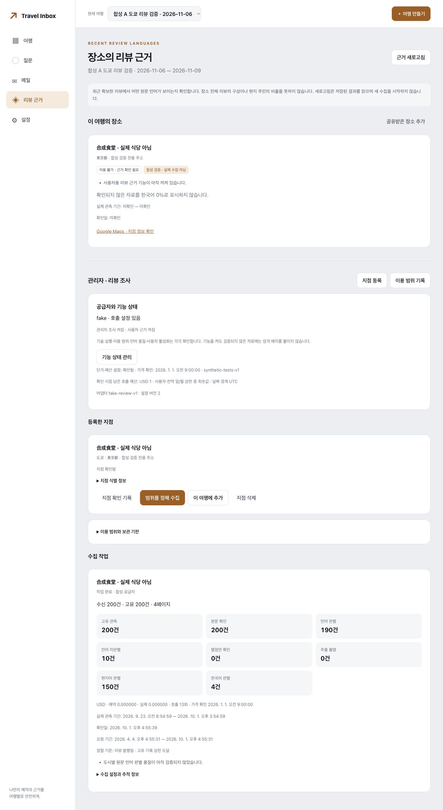
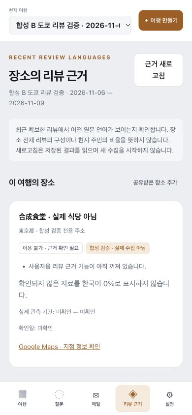

# 03 리뷰 데이터: 구현·합성 검증·실제 모델 평가

작성/검증: 2026-10-01. 저장소 `/Users/jinsangwoo/Desktop/ChatGPT/travel-inbox-rag`, 시작 revision `aefee57`. 기존 사용자 변경과 01/02단계 코드를 보존했다. 이번 결과는 미커밋 코드·화면·검증 기록이며 외부 배포/실제 사용자 계정 설정이 아니다.

## 판정

| 항목 | 실제 상태 |
| --- | --- |
| 교체 가능한 provider, fake/Apify HTTP 어댑터 | 코드 완료, mock HTTP 검증 |
| 인증·admin scope·durable job·비용·lease·SSE 재사용 | 코드/합성 통합 검증 완료 |
| 24개 지정 언어 계산 사례 | 전부 통과 |
| 수집 기간·페이지·중복·번역·미판별·부분 실패 | 합성 시험 통과 |
| SQLite migration 3·보관/정책 삭제·백업 복원 | 합성 시험 통과 |
| 관리자/소비자 화면 | 합성 OIDC 실제 브라우저 흐름 확인 |
| 로컬 언어 모델 실제 실행 | 일반 문장 진단 완료, 음식점 리뷰 품질 미검증 |
| A: 6곳×100건 | **not_run** — Apify 키 없음, 실제 이용 범위·계정·지점·잔액 미확인 |
| B: 10곳×200건 | **not_run** — A 검증과 도시별 리뷰 라벨이 선행되어야 함 |
| 실제 Google 원문 리뷰 수집량·과금 | **0건 / 신규 유료 호출 없음** |
| 운영 `production_enabled` | **OFF** — 실제 권한/원문/정렬/도시별 품질 검증 미완료 |
| 04 종합 장소 추천·일정 엔진 | 이번 구현 범위 밖 |

Places API의 최대 5개를 웹 리뷰 수집의 기술적 상한으로 사용하지 않았다. Apify의 현재 비동기 Actor와 dataset 페이지 경로를 구현했다. 다만 dataset offset 연속성이 Google 원천 리뷰 전체의 완전성을 입증하지 않으며 newest의 정확한 날짜 의미도 공개 자료만으로 확정하지 않았다. 실제 어댑터 기본값은 `sort_basis=unknown`, `continuity_verified=false`, `contract_verified=false`다.

## 구현 범위

- `src/providers/reviews.py`: 상한이 있는 frozen 입력, capabilities, 안전한 page DTO와 provider 인터페이스.
- `src/providers/apify_reviews.py`, `fake_reviews.py`: 실제 HTTP/합성 공급자. Apify start/poll/page/abort/delete를 숨은 재시도 없이 연결. 고정 HTTPS origin·redirect 차단·응답 크기/MIME/시간 제한·본문과 지점 필드 whitelist.
- `src/research/collection.py`: 최신순 180일·최대 200 고유 기록·20페이지·페이지당 2시도. rating-only도 상한 포함. 수신과 고유 수, overshoot, 반복 cursor/page, 중복 ID, 순서 역전, 날짜 모호성, 기간 기준과 종료 사유 분리.
- `normalization.py`, `metrics.py`, `config.py`: 작성자/프로필 제외, 원문/번역/혼합/별점-only/추출 불명 구별. 정수 불변식·정확한 경계값·null 분모·표시/엄격 비율·권한/품질 gate. 주민·전체 모집단 추정은 항상 false.
- `language.py`, `scripts/review_language_eval.py`: 버전·license·binary hash가 있는 Lingua 로컬 판별과 독립 dev/devtest 평가. 원문을 LLM에 일괄 보내지 않는다.
- `schema.py`, `service.py`, `calls.py`, `routes.py`: 정책별 사용 범위, 지점 확인, 연구/운영 상태, 원자적 job+run 생성, 정규화된 SQL 영수증, 과금 예약, 실행별 cap, 캐시 포인터, 보관/권한 철회, 최소 삭제 outbox, 관리자/여행별 API.
- 기존 `Database` migration과 `Jobs.enqueue`는 caller transaction을 지원하도록 확장했다. admin research scope는 개인 trip_id를 사용하지 않는다. 일반 job/SSE의 철회된 연구 범위는 404로 차단한다.
- `src/foundation/cli.py`, `src/research/maintenance.py`: 로컬 관리자 role 명령(세션 회수·audit) 및 최신 연구 tombstone을 적용하는 복원 경로. 오래된 백업의 허용 상태를 그대로 되살리지 않는다.
- `web/index.html`, `web/js/foundation.js`, `web/css/foundation.css`: 리뷰 근거 메뉴, 관리자 지점·권한·수집 입력·진행/비용/기간/종료 이유, 소비자 unavailable 사유·분모·출처 UI.

리뷰 본문·번역·작성자·프로필·본문 hash를 앱의 DB/로그/예약 Chroma/작업 파일/SSE에 저장하지 않는다. raw_store가 허용되어도 이 구현의 로컬 원문 저장 수는 0이다. 허용된 ID·판별 결과만 checkpoint/영수증으로 남긴다. Apify 원격 dataset의 원문 보관은 별도 권한·TTL·삭제 조건을 검사한다.

## 자동 테스트

최종 전체 실행:

```bash
.venv/bin/python -m pytest -q --tb=short
# 495 passed, 2 warnings
node --test tests/test_service_worker.cjs
# 2 passed
node --check web/js/foundation.js
node --check web/sw.js
.venv/bin/python -m py_compile api.py src/research/*.py src/providers/*.py
git diff --check
# exit 0
```

Python 경고 2개는 기존 Starlette/Authlib의 httpx 호환 API deprecation이다. 실제 호출 키나 인터넷 없이 기본 테스트가 통과한다. 모델 일반문장 corpus 다운로드/평가는 별도 명시적 명령이며 기본 CI가 실행하지 않는다.

| 테스트 | 범위 |
| --- | --- |
| `test_review_metrics.py`, `test_review_normalization.py` | 80개. 지정 RL-01~24 전체 deep merge/array replace, 1e-12 허용 오차, 계산 경계·zero/null·negative·불변식·locale/원문/번역·rating-only·dedupe |
| `test_review_provider.py` | 48개. 실제 어댑터 mock HTTP, 최대수/페이지/재시도, 날짜/수정일, 중복/정렬/반복 cursor, overshoot, checkpoint, cap/차단/부분 종료 |
| `test_review_language.py` | 21개. 판별 규칙·모델 metadata·unknown·분모·지원 표본 없는 Korean recall·평가 분리 |
| `test_review_integration.py` | 16개. API/job/예산, 동시 중복, admin/다른 admin/member 권한, 여행 소유권, SSE 이어받기, raw/PII 누출, 정책/지점/role 철회, TTL/백업 복원, 최소 상태와 CLI audit |
| `test_review_recovery.py` | 9개. 실제 자식 프로세스 SIGKILL 후 시작 영수증/페이지 영수증/checkpoint/집계 commit 복구, 응답 유실 unknown, fencing, 모델 버전 변경, 비용 cap |
| `test_review_remote_cleanup.py` | 6개. 실제 HTTP 없는 Apify 형태의 fake. 선예약·전체/Actor 상한·원격 삭제·철회/만료 후 늦은 시작 응답·삭제 미확정·보관 권한 |

리뷰 신규 시험은 180개이고, 기존 315개 회귀와 합쳐 495개다. 합성 시험 통과는 실제 리뷰 수집량·이용 권한·언어 정확도의 증거가 아니다.

## 브라우저 실행 결과

실행 명령: `.venv/bin/python tests/review_browser_fixture.py`. 임시 SQLite, 합성 OIDC 8766, 서비스 8765, fake provider만 사용했다. 실제 Authlib state/nonce/PKCE/JWT 경로를 통과했지만 실제 Google 로그인 검증은 아니다.

1. 합성 A(관리자) 로그인 → 리뷰 근거 탭 → 합성 지점의 수집 범위 입력 → 202 작업 접수.
2. 수집 중 브라우저 새로고침 → 동일 run/job을 다시 조회. 작업 1개와 시작 호출 1회를 유지하며 새 수집을 만들지 않음.
3. 4페이지·200고유 기록 완료. T=200, C=190, U=10, L=150, K=4. 관리자 화면에 실제 기간·처리 수·비용·`record_cap` 표시.
4. 계산 결과 L/C=78.947…%, K/C=2.105…%, L/T=75%, (K+U)/T=7%. **합성 값**이며 언어 평가 미검증으로 unsupported 유지.
5. 로그아웃 후 합성 B(일반 사용자) 로그인. A 관리자 영역이 사라지고 B 여행에 연결된 장소의 unavailable 사유만 표시. 한국어 0% 대체 수치 없음.
6. 390×844 모바일 화면: content width=390, viewport=390, 가로 넘침 없음. 브라우저 error console 0건.





## 실제 로컬 언어 모델 결과

Lingua 2.2.0 + `review-language-rules-v1`, 모델 포함 binary 약 307MB, 실행 peak RSS 226.44MiB. 공개 FLORES-200 일반 문장(CC BY-SA 4.0), 개발 250건과 heldout 1,000건의 본문 hash 겹침 0건. 임계값을 이 실행 결과로 재조정하지 않았다.

현지어 precision은 두 도시 언어 프로필에서 100%, 한국어 recall은 **94.5%(189 TP / 11 FN)**, unknown 51/1,000이었다. 95% recall 목표에 미달하며 음식점 리뷰 도메인도 아니다. 따라서 actual review classification은 `CLASSIFICATION_QUALITY_UNVERIFIED`다. 도시별 실제 음식점 리뷰 독립 평가 건수는 0이다. 실제 음식점 리뷰 평가 100건/도시, 한국어 지원 사례, 원문 대조를 완료하기 전에는 운영 근거로 사용할 수 없다.

상세 per-language confusion matrix·출처·라이선스·모델/데이터 hash·메모리 측정 방법은 [언어 평가 보고서](LANGUAGE_EVALUATION.md)에 있다. 이 메모리는 서버+Chroma 전체 측정이 아니므로 512MB 운영 환경 적합성을 보장하지 않는다.

## 라이브 실행 설정과 다음 단계

Apify 키 2개 변수(`APIFY_TOKEN`, `APIFY_API_TOKEN`)의 존재 여부만 검사했고 모두 false였다. secret 값은 출력하지 않았다. 공식 문서의 현재 필드·build·요금은 [공급자 검증 보고서](APIFY_PROVIDER_VERIFICATION.md)에 기록했으며, 가격을 서비스 코드에 과거 고정 단가로 넣지 않았다. 계정 잔여 무료량·유료 최소 결제·실제 데이터 이용 범위는 미검증이다.

[A/B 실행 설정](../examples/review-pilot-plan.json), [가격 설정 template](../examples/review-pricing.template.json), [운영 안내](../REVIEW_RUNBOOK.md)를 준비했다. 현재 target ID는 실제 검증 전이므로 비어 있다. A 결과와 원문 구조 확인 후 B를 실행해야 하며, 제안 $3 전체 상한은 신규 결제 승인으로 해석하지 않았다. 신규 결제/구독/카드 등록은 하지 않았다.

04단계에서는 검증된 `place_id`를 여행에 연결하고 `review-evidence` DTO의 state, decision, reason_codes, counts/metrics, coverage, checked_at/expires_at, synthetic 여부를 소비한다. unavailable·만료된 값을 0점/한국어 0%로 바꾸거나 엄격 후보로 포함하지 않는다. 평점·전체 평가 수의 별도 필터, 대표 명소/현지어 탐색의 구획, 예약 사실·동선·일정 생성은 다음 구현 범위다.
