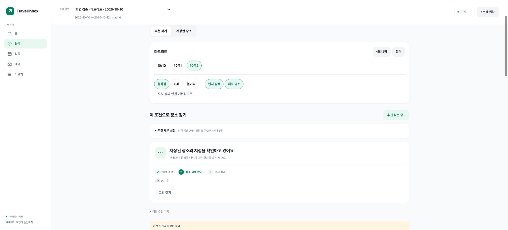

# 식당 추천 표시·초록 디자인 검증

2026-10-06. 실제 식당 지점의 최소 사실, 합성 계정 시험, 운영 계정 확인을 구분한다.

## 구현과 적용

추천 엔진의 `items`가 비어 있어도 실제 `needs_confirmation` / `insufficient_data` 후보를 카드로 볼 수 있다. 서로 다른 지점을 기준으로 전체 표시 수와 조건 충족 수를 따로 세며, 이미 확인된 조건 위반은 제외 상태에 둔다. 필수 조건·언어 기준·점수 성분은 완화하지 않았다. 점수 null과 위치/가격/잔여석 미확인은 그대로다.

실제 job 단계·처리 건수를 노출하고 SSE/새로고침에서는 같은 job을 이어받는다. 클릭 직후 입력 확인, 중복 실행 방지, 이전 결과 보존, 재연결·예산·취소·실패별 행동을 제공한다. 새 요청의 입력 확인 중 이전 terminal job의 취소 버튼·오류가 남던 문제도 운영 검증에서 찾아 수정했다. 진행률 퍼센트와 완료 예상 시각은 만들지 않았다.

공식 출처 기초 자료는 도쿄·바르셀로나·마드리드 각각 3곳이다. [출처 검수 기록](official-restaurant-sources.md), [운영 등록 절차](catalog-operations.md). 일반 공개 페이지의 최소 사실과 자체 요약·링크만 다루며 사진·리뷰·페이지 전문을 저장하지 않는다. 검토한 범위를 넘어선 라이선스 허가를 주장하지 않는다.

[디자인 시스템](../DESIGN_SYSTEM.md)은 toss.md의 정보 위계·여백·상태 피드백을 주 참고로, yeogi.md의 여행 문맥을 보조로 사용했다. 초록 주요 행동/중립 표면, light/dark semantic 토큰, 44px 클릭 영역, 큰 글자·키보드·reduced motion을 적용했다. 숙소 요약은 모바일 약280px에서135px로 줄였고, 거리·출발점 세부값을 접힌 옵션으로 옮겼다. 원문 시간 구조를 변경하지 않고 영업 안내를 한국어 요일·시간 구간·다음 날로 읽기 쉽게 바꿨다.

## 테스트

| 검사 | 결과 |
|---|---|
| Python 전체 | 889 passed / 12 skipped / 2 warnings, 98.34초 |
| PostgreSQL 핵심 회귀 | 114 passed / 1 skipped / 2 warnings, 54.94초 |
| 최종 Node 전체 | 62 passed, 159.84ms |
| JS 문법·asset hash·diff whitespace | 통과 |
| 공식 자료 계약 시험 | 3도시 각 표시3·조건충족0·외부호출0 |

```sh
PYTHON_DOTENV_DISABLED=1 .venv/bin/python -m pytest -q
node --test tests/*.cjs
python3 scripts/version_web_assets.py --check
PYTHON_DOTENV_DISABLED=1 TRAVEL_TEST_POSTGRES_DSN="$DISPOSABLE_TEST_DSN" .venv/bin/python -m pytest -p tests.postgres_plugin tests/test_catalog_registration.py tests/test_catalog_presentation.py tests/test_recommendation_api.py tests/test_discovery_foundation.py tests/test_stage2_recommendations.py tests/test_discovery_intents.py -q
PYTHON_DOTENV_DISABLED=1 .venv/bin/python scripts/restaurant_browser_fixture.py
```

PostgreSQL은 작업 전용 `pgvector/pgvector:pg17` loopback55438의 임시 DB였다. 운영 DSN을 테스트에 넣지 않았다. Python skip12는 임시 PostgreSQL DSN이 없는 기본 실행에서 cloud storage11개와 schema12 upgrade1개를 실행하지 않은 것이며, PostgreSQL skip1은 SQLite 전용 실제 프로세스 강제 종료 시험이다. Starlette/Authlib의 기존 httpx 폐기 예정 경고2건을 숨기지 않았다. 각 집합은 중복이므로 합산하지 않는다. 정적 공식팩 계약 시험은 메모리 복사본의 확인/만료 시각을 시험 시각으로 옮기며, 원본 팩의 현재 신선도 증거로 사용하지 않는다.

## 브라우저 확인

Chrome/macOS 합성 계정과 여행 + 실제 공개 식당 최소 사실로 실행했다. 위치·경로·언어 품질은 실제 공급자를 호출하지 않았다. 로컬 fixture만 실제 progress 기록 뒤 1.5초씩 기다리게 하여 진행 상태를 관찰했고, 이를 운영 지연 측정으로 보고하지 않는다.

1. 합성 OIDC 로그인 → 마드리드 음식점 추천 → 실제 단계/버튼 busy/3곳 표시.
2. 다른 방문일로 추천 중 새로고침 → 같은 진행 작업과 이전 날짜 결과가 복원됨. 새 POST 없이 서버의 기존 job 조회.
3. 조건 충족0/방문 전 확인3 구분, 실제 지점명·주소와 공식 출처, 가격/거리/인원/잔여석 미확인 확인.
4. 상세의 영업시간을 한국어 요일 순으로 표시. 다음 날 종료·여러 구간·휴무 예외·메모 보존은 Node 시험에서도 검증.
5. 390px 숙소 옵션의 접힘/펼침·거리 선택·펼침 유지, 가로 넘침0. 319px/글자200%/dark에서 document319px와scroll319px, modal252px와scroll252px, body30px 확인. 다크에서 남아 있던 이전 amber 우선순위를 제거하고 실제 초록색을 확인했다.
6. Escape로 상세창을 닫으면 원래 상세 버튼에 포커스가 복귀. 검사 후 테마·글자 크기·viewport 복원.

실물 iOS/Android/Safari, 스크린리더 음성 출력, 실제 식당 예약 응답·도보 품질·원문 리뷰 언어 정확도는 이번 시험 범위 밖이다.




## 운영 반영

실제 URL: https://travel-inbox-rag.onrender.com . Render Free/Supabase hii, 기존 무료·공급자 설정 유지.

- 주 변경 `3037adae990a4e3fa4e118e63baeac6b245c712d`, 배포 `dep-db2c5vnlk1mc73at0hh0`, 성공1분13초.
- 마지막 UI 수정 **`3a78fdf12c65d845e3c5a3de0364ca9de05f9bae`**, 배포 **`dep-db2c8e4s728c73bubcj0`**, Render **Deploy succeeded|Live**, 1분05초, **2026-10-06 18:50:50 KST** live 로그.
- schema12, approved pack3/candidate9/evidence source10. [HTTPS·자산·집계 확인](green-live-verification.json). 개인 API 비로그인401, 유료 건강 검사 없음.
- 실제 기존 인증 세션으로 추천 요청 → 마드리드 실제3곳 → 공식 상세 → 재배포/새로고침 후 결과 유지. 마지막 버전에서 새 요청의 validating 중 이전 취소 버튼·오류가 없음을 실제 화면에서 확인했다. 관측 console error0.
- 현재 여행 제목/숙소 주소와 등록 도시가 다름을 발견했다. 등록 도시는 Madrid이며 제목만으로 도시를 수정하지 않았다. 바르셀로나 결과를 원하면 사용자가 여행 수정에서 도시를 맞춰야 한다.
- Google OAuth 신규 로그인 왕복은 이번 운영 검증에서 재수행하지 않았다. 로컬 합성 OIDC와 기존 운영 세션 확인을 구분한다.
- 이전 여행·도시 구간·예약·교정값은 모두 동일하다. [자료 보존 확인](green-live-preservation.json): 문서6건도 내용 해시와 메타데이터는 동일하며, `opaque_path`는 클라우드 백업이 격리 파일 경로로 바꾸는 필드여서 문자열 비교에서 제외했다. 원문이 변경됐다는 뜻이 아니다.
- 등록 전 암호화 백업17.06초·격리 복원0.05초, 무결성/FK 정상·삭제 부활0·복원 세션0. 비밀·원문·운영 화면 캡처는 Git에 넣지 않았다.

## 남은 경계와 다음 한 가지

등록 도시100개와 실제 장소3도시는 별개다. 이번3도시도 지점 기초 자료이며 방문 조건을 모두 검증한 추천이 아니다. 외부 식당 자동 검색·갱신은 아직 미구현, 실제 경로와 엄격 언어 기능OFF다. 원문 리뷰 수집·언어 분석 결과를 만들지 않았다. 유료 호출 또는 신규 지출은 없다. Render Free의 기동 대기는 남아 있다.

다음 우선순위는 **허용된 공급자의 요청 시 장소 검색과 필요한 사실 갱신**이다. 사용자 가치: 미등록 도시에서도 후보를 찾는다. 근거: 지금97도시는 실제 후보가 없다. 비용: 검색·상세·경로/리뷰를 분리해 최대 요청수·기한·원자적 예산 상한을 둬야 한다. 의존성: 정확한 지점 식별과 공급자별 보관·출처 정책. 저장 자료를 먼저 보여주고 부족/만료만 별도 job으로 갱신하며, 모든 식당의 리뷰를 매클릭 전수 재수집하지 않는다. 이 내용은 후속 설계이고 구현 완료가 아니다.
