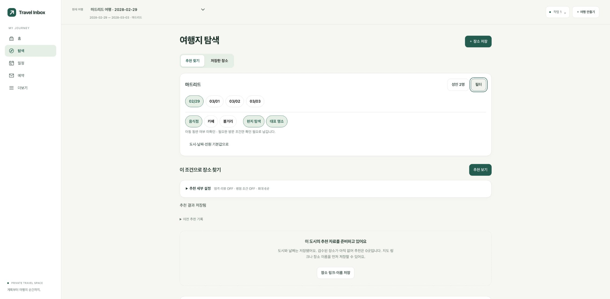
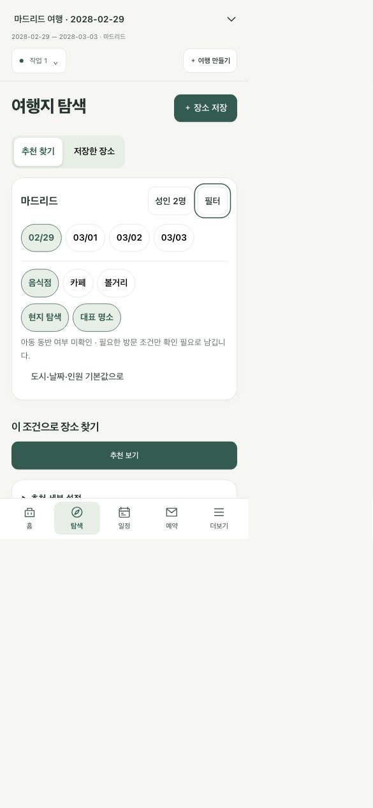

# V3 1단계 구현·검증 보고서

검증일: 2026-10-06, Chrome/macOS. 대상은 입력 간소화와 여행→탐색→장소 저장이다. 숙소 지점 확인·실제 거리/경로는 2단계이며 이번 결과에 포함하지 않는다.

## Before / After / Why

| Before | After | Why |
|---|---|---|
| 주요 기능이 여러 메뉴로 분산 | 홈·탐색·일정·예약 + 더보기 | 처음 사용할 때 선택해야 할 경로를 줄임 |
| 도시·날짜·인원을 조건 폼에서 다시 입력 | 여행 기본값 상속, 직접 바꾼 값만 override | 중복 입력과 오래된 체류일 오류를 줄임 |
| 조건 저장과 추천 요청이 별도 행동 | ‘추천 보기’ 한 번으로 조건·run·job 원자적 접수 | 중간 실패/중복 클릭을 서버에서 처리 |
| 전체 도시 목록과 긴 상세 폼 | 로컬 100도시 검색, 날짜 칩, 선택 입력 펼치기 | 짧은 첫 여행 입력과 키보드 선택 지원 |
| 불명확한 아동 정보가 빈 목록 | 미확인·없음·있음 구분 | 미확인을 아동 없음으로 판정하지 않음 |
| 후보 없는 도시에서 다음 행동 모호 | 검수 자료0 안내 + 장소 이름/링크 저장 | 실제 추천 범위를 과장하지 않고 계속 사용 가능 |
| 상세에서 저장하려면 다시 카드로 이동 | 상세 안에서 저장·중복 상태 확인 | 탐색→상세→저장 흐름 유지 |
| 새로고침 후 기본 여행으로 복귀 가능 | 인증 후 소유 여행/마지막 화면 ID 복원 | 개인 본문을 캐시하지 않고 문맥 유지 |

Emil design engineering 원칙을 적용했다. 반복 작업에는 추가 애니메이션을 넣지 않았고, 기존 색/타이포그래피/아이콘 체계를 재사용했다. 날짜 칩과 필터는 44px 이상 터치 목표, 모달은 Tab 순환/Escape/호출 버튼 포커스 복귀를 제공한다.

## 저장/API 변경

- schema 10→11: `discovery_contexts`, `discovery_intents` 두 테이블 추가. SQLite/PostgreSQL 모두 적용. 기존 여행/예약/조건 JSON/추천 snapshot은 다시 쓰지 않는다. [이관·복구](../MIGRATION_11.md).
- `context.py`: `trip_context`, sparse `overrides`, `conditions`, 필드별 `provenance`, 검증 오류/경고, resolver/origin version을 결정적으로 계산한다. 생략은 상속, 명시 null은 비움이다. 기존 저장 조건은 전체 명시 override로 읽는다.
- stop 수정은 기존 ID를 유지한다. 재방문/순서 변경/삭제를 구분하며 삭제된 선택 구간은 재확인을 요구한다. 한 도시가 전체 기간을 쓰던 경우 여행 기간 수정 시 같은 stop ID로 날짜를 상속한다. 예약을 자동 이동하지 않는다.
- 도시·날짜·출발점 변경 시 옛 좌표는 계산에서 제외하고 라벨/원래 입력을 비교용으로 보존한다. 좌표가 다음 GET에서 다시 활성화되지 않는다.
- `POST /api/v2/trips/{trip_id}/discovery-intents`: 인증/소유권/버전/체류일 검사 후 조건·context·immutable run·job·receipt를 같은 트랜잭션으로 저장한다. 트랜잭션 안에서 유료/네트워크 호출하지 않는다.
- 입력: expected trip/conditions version, stop ID, YYYY-MM-DD visit date, 전체 sparse override 집합, 리뷰/평점/개수 필터. `owner_id`는 허용하지 않는다.
- 응답: intent/run/job ID, 상태·SSE·intent URL, conditions version, resolved context. 동일 key+payload는 동일 receipt, 다른 payload409, 다른 사용자/삭제 여행404, 잘못된 날짜422. 기존 PATCH/추천 API는 호환 유지.
- 새로고침은 기존 run/job 조회로 복원한다. 응답 유실 재시도의 무작위 key는 사용자/여행/입력 해시로 식별해 sessionStorage에 보관한다. 개인 조건 전문은 그 저장소에 넣지 않는다. 로그아웃 시 힌트를 제거한다.
- 별도 조건 저장이 없는 version0 일정도 생성·preview·apply·undo를 지원한다. 저장된 revision의 제약/현재 버전 검사는 그대로 수행한다.
- 기존 인증, 예산, job lease, 삭제 tombstone, 예약 교정, 검색 세대는 유지. 삭제/백업 복원 scrub에 새 두 테이블도 포함한다.

## 실제 실행 결과

저장소 루트, 개발 `.env` 자동 로드를 끄고 실행했다.

```sh
PYTHON_DOTENV_DISABLED=1 .venv/bin/python -m pytest -q
node --test tests/*.cjs
python3 scripts/version_web_assets.py --check
node --check web/js/foundation.js
git diff --check
```

- 최종 Python: **770 passed, 11 skipped, 2 warnings, 107.45s**. 기존 748개 baseline 대비 22개 증가. 11개는 해당 외부 환경이 없는 시험이다. 경고2개는 Starlette/Authlib의 httpx 사용 폐기 예정 안내이며 테스트 실패가 아니다.
- JavaScript: **38 passed**. asset hash·JS syntax·diff 검사 통과.
- 구현 중 schema9→current 시험이 새 테이블을 남겨 중복 생성으로 1회 실패했다. 이전 버전을 모사하는 fixture를 실제 schema9 상태로 고쳤다. 최종 전체 시험 통과.
- 조건 version0 일정 편집 검증을 추가하며 남아 있던 ‘조건 행 필수’ 검사와 None 역참조를 고쳤다. 생성→잠금 preview→apply version2→undo preview→apply version3 검증, 조건 행은 계속0개다.

PostgreSQL은 **운영 DB가 아닌** loopback의 임시 pgvector/pg17 컨테이너와 시험별 격리 schema로 실행했다.

```sh
# TRAVEL_TEST_POSTGRES_DSN에는 임시 localhost PostgreSQL 연결을 설정한다.
PYTHON_DOTENV_DISABLED=1 .venv/bin/python -m pytest -p tests.postgres_plugin   tests/test_discovery_intents.py tests/test_itinerary_api.py -q
```

**42 passed, 1 skipped, 2 warnings, 48.29s**. skip1은 SQLite 전용 프로세스 kill 시험이며 SQLite 전체 suite에서는 실제 subprocess kill/rollback으로 통과했다. 별도 앞선 PostgreSQL 추천/피드백/intent 계약41개도 통과했다. Supabase REST 권한을 우회하거나 운영 테스트 schema를 생성하지 않았다.

검증한 실패 조건: A/B 각각2여행, foreign trip/stop/intent404, 동시 같은 key 한 job, 다른 key 동일 expected version202/409, 같은 key 다른 payload409, enqueue 뒤 예외에서 전체 rollback, 프로세스 kill, 재시작 receipt, 삭제 후 조회 차단, 비연속 체류일, stop ID 보존/재정렬/삭제, legacy 명시값 보존, 명시 null, 오래된 좌표 무효화, 0000/6자리/불가능한 날짜, 최신 draft를 덮지 않는 이전 응답. 기존 전체 suite에 100도시·12eml·하루8+수동1·추출 실패 시 활성 예약 보존 회귀가 포함된다.

## 브라우저에서 실행한 흐름

`PYTHON_DOTENV_DISABLED=1 STORAGE_BACKEND=local .venv/bin/python tests/browser_discovery_fixture.py`로 합성 OIDC/장소를 실행했다. 실제 사용자 여행을 테스트 입력으로 고치지 않았다.

1. 로그인A → English Tokyo 검색/키보드 선택 → 도시와 날짜만으로 여행 생성 → 상속 조건 추천 한 번 → 합성 장소 상세 → 상세에서 저장 → 저장됨/중복 방지 확인.
2. 새로고침 후 같은 여행과 장소 보관함 복원. 서버 프로세스를 종료하고 같은 fixture DB로 재시작한 뒤 저장한 장소 재조회.
3. 필터 변경 중 기존 결과의 성인1명 기준과 새 draft 성인2명을 구분. 필터 모달의 ‘이 필터로 추천 보기’ 한 번으로 새 작업 접수.
4. Madrid 여행을 2028-02-29부터 생성. 정확한 Madrid/Europe-Madrid 구간, 후보0 안내, 이름만 입력한 장소 저장과 ‘지점 미확인’ 상태 확인. 가짜 추천 카드를 채우지 않음.
5. 6자리 연도 전체 값 입력은 저장 단계에서 거절하고 인라인 오류/입력 보존. 정상 네 자리/윤년 날짜로 고쳐 생성 성공. native min/max와 날짜 수정 확인. 앞선 V3 검증에서 연속 숫자 입력을 확인했다. 이번 자동화에서는 OS native 달력 팝업 내부 선택을 확실히 관측하지 못했으므로 이를 검증 완료로 세지 않는다.
6. 실제 CSS viewport390px에서 scrollWidth390. 약320px 경계는 브라우저 확대 반올림 때문에319px/321px로 검증했고 둘 다 넘침 없음. 앱의 글자200%에서319px 문서/필터 모달 가로 넘침 없음.
7. 긴 일본어 이름, combobox ArrowDown/Enter, 모달 첫/끝 Tab·ShiftTab 순환, Escape 후 필터 버튼 복귀 확인. 일반 console error 관측0.
8. 홈/탐색/일정/예약4메뉴, 더보기 기존 경로, 예약의 업로드·수동 입력·준비 할 일·12개 테스트메일 링크를 확인. ZIP은 앞선 V3 실제 다운로드에서 원본 SHA256 일치를 검증했다.





실물 iOS/Android/Safari, OS별 달력 선택 UI, 실제 공급자 추천/메일 분석 정확도는 미검증이다. 합성 장소가 표시된 로컬 E2E를 운영 추천 품질이라고 보고하지 않는다.

## 운영·비용·복구

- Render Free + 기존 Supabase hii, 현재 인증/secret/0원 정책 재사용. 신규 유료 작업·인프라 증설 없음. public shell v14, 개인 API service-worker 캐시 없음.
- 배포 전 schema10 클라우드 DB/원문 snapshot 암호화 백업13.54s, 최신 checkpoint와 격리 로컬 복원0.05s. archive768044bytes, SQLite integrity `ok`, 기존 여행/예약 건수 일치. 암호키/백업본문은 Git·로그·이 보고서에 포함하지 않음.
- 이 실측은 작은 현재 데이터셋 기준이다. Supabase로 실제 재주입하는 재해 복구/모든 규모 RTO를 검증한 것은 아니다. 복원본은 RESTORE_PENDING 상태를 유지했다.
- 실제 배포 revision/URL/health는 [진행 기록](../IMPLEMENTATION_STATUS.md)의 최신 운영 반영 항목을 본다.

## 2단계 연결점과 남은 위험

- `trip_context.stop_id`, sparse origin, `origin_version`은 구조화된 숙소/날짜별 출발점 연결점이다. 지금 숙소는 label-only이며 지점 확인·도보 분수·경로 matrix를 새로 구현하지 않았다.
- 등록100도시는 입력/탐색 컨텍스트 지원이다. 운영 실제 후보가0인 도시는0으로 유지한다. strict 언어 기능 OFF, AI/유료 지도·검색·리뷰 OFF 상태에서 신규 공급자 데이터가 생기는 것으로 설명하지 않는다.
- Render Free 휴면/첫 요청 대기 제약은 그대로다. 외부 서버 장애/미지원 폰의 실사용을 이 로컬 브라우저 검사로 보장하지 않는다.
- 새 DB version11은 schema10 전용 옛 이미지가 그대로 읽을 수 없다. 무조건 이전 이미지 Rollback 대신 전진 수정 또는 최신 삭제 checkpoint를 반영한 검증 복원을 사용한다.
