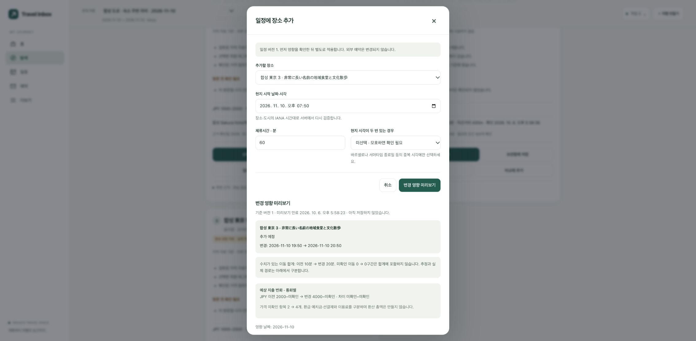
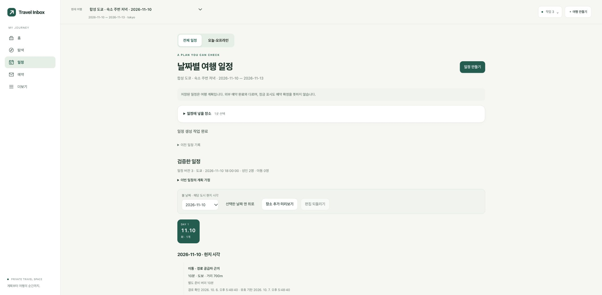
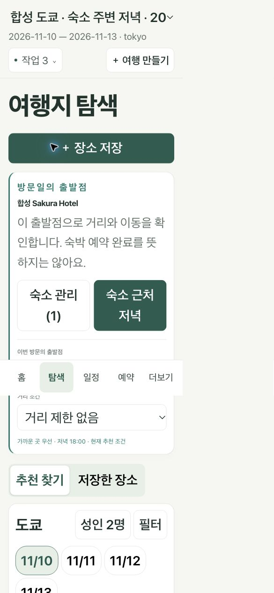

# V3 2단계 — 숙소·이동 추천·일정 연결 검증

검증일: 2026-10-06. 1단계 schema11/단일 탐색 intent/4메뉴를 재사용했다. 코드·합성 시험 완료와 실제 공급자·운영 배포 상태를 구분한다.

## 구현 범위

- 개인 숙소 schema12: owner/trip/stop/version, 숙박일 `[checkin, checkout)`, 원입력·메모·예약 참조와 지점 확인 상태를 분리했다. 이름 저장과 지점 확인 job은 별개이며 서버 후보 ID만 명시적으로 선택한다. label-only 이관과 SQLite/PostgreSQL, RLS, tombstone·복원 삭제 재적용을 연결했다. [이관/복구](../MIGRATION_12.md).
- 홈·탐색에서 한 필드로 숙소 저장. 날짜는 기존 도시 구간을 제안하며 예약 사실로 확정하지 않는다. 기존 숙박 예약 후보, 동명 지점 선택, 파일/개인 자료와 분리된 전용 저장, 필드 오류·409 입력 보존, 새로고침 job 복구를 제공한다.
- 날짜별 순수 origin resolver: 사용자 선택 우선, 숙소 하나/겹침/공백/체크아웃 후보/방문 시각을 구분한다. 이름만으로 도시 중심·0,0·유명 호텔을 채우지 않는다. 기존 수동 좌표는 수동 출처를 유지한다. 변경된 숙소 기준의 추천·일정은 재확인이 필요하다.
- Geocoding/Route의 disabled/fake/Google 어댑터, 후보 축소 후 matrix 상한, 각 element 오류·시간·출처·권한·TTL, 사용자별 캐시, durable receipt·비용 예약/unknown 정산을 기존 job/gateway에 연결했다. 현재 운영 기본은 **OFF**다. [공식 계약/가격 조사](stage2-provider-research.md).
- 직선거리는 `haversine_straight_line`, 실제 경로는 별도 근거다. 도보 실패에도 유효 직선거리는 남긴다. 직선 1km와 도보 15분 필터를 분리하고 도보 unknown을 엄격 통과시키지 않는다. v1 점수를 보존하고 변경된 거리 계산은 v2 모델로 저장한다.
- ‘숙소 근처 저녁’은 출발점·저녁 18시·가까운 곳 선호를 눈에 보이는 draft에 채운다. 기존 예산·필수 조건·리뷰 gate를 변경하지 않는다. 추천 카드의 상세·저장·일정 추가, 동일 방문 조건 최대 3곳 비교, 이전 조건 결과 안내를 연결했다.
- 추천/보관함 상세의 장소 선택은 기존 일정 command/validator에 전달된다. 양쪽 이동, 체류, 영업, 고정 예약, 출발점 버전, 아동 조건 unknown을 재검증한다. preview는 통화별 알려진 비용 차이와 미확인 수를 보이고 apply는 409 원본 보존/성공 새 revision, undo도 새 revision이다. 거리 필터용 검증 leg는 실제 이동·비용에 중복 합산하지 않는다.
- 새 `accommodations.js`, public shell v15, 콘텐츠 hash. 개인 API는 일반 service-worker 캐시 대상이 아니다. 메일 체험팩의 가짜 숙소를 실제 공급자 지점에 자동 연결하지 않는다.

## UI 검토 — emil-design-eng 적용

| Before | After | Why |
|---|---|---|
| 숙소 이름과 출발점 좌표의 연결이 없고 반복 입력 필요 | 이름/지도 링크 한 필드, 도시 구간 날짜 제안, 확인 지점 재사용 | 첫 입력과 이후 탐색의 부담 감소 |
| 저장과 위치 확인의 성공 의미가 모호함 | 저장됨·지점 후보·확인됨·위치 미확인을 각각 표시 | 이름 저장을 거리 계산 성공으로 오해하지 않음 |
| 직선거리와 이동시간을 함께 판단하기 어려움 | 직선거리와 경로 시간·확인일을 별개로 표시 | 실패·미확인을 0분으로 읽지 않음 |
| 장소를 일정에 다시 찾아 넣어야 함 | 카드/상세에서 같은 장소를 선택한 편집 미리보기로 이동 | 선택 맥락을 유지하면서 기존 검증 재사용 |
| 숙소 변경 이후 과거 결과가 현재처럼 보일 수 있음 | 이전 조건·출발점 변경 안내, apply 직전 409 | 저장된 근거와 현재 판단을 구분 |
| 초기 화면 비동기 복원이 사용자의 탭 선택을 덮어씀 | navigation revision으로 직접 선택 우선 | 탐색 클릭 직후 일정으로 되돌아가는 경쟁 제거 |
| 새로고침 중 job이 완료되면 후보 목록이 늦게 갱신됨 | terminal job 확인 후 숙소 목록 재조회 | 완료된 작업을 다시 실행하지 않고 결과 복원 |

장식 모션을 추가하지 않았다. native dialog focus trap/Escape/복귀, 텍스트 상태와 aria live, 기존 reduced-motion 규칙을 유지한다.

## 재실행 명령과 결과

저장소 루트, 기존 `.venv`, 유료 개발 `.env` 자동 로딩 OFF 기준이다. PostgreSQL은 운영과 다른 임시 pgvector/pg17의 테스트 DSN을 사용한다. 테스트 환경변수에 실제 운영 DSN을 넣지 않는다.

```sh
PYTHON_DOTENV_DISABLED=1 .venv/bin/python -m pytest -q
node --test tests/*.cjs
python3 scripts/version_web_assets.py --check

PYTHON_DOTENV_DISABLED=1 TRAVEL_TEST_POSTGRES_DSN="$DISPOSABLE_TEST_DSN" .venv/bin/python -m pytest -p tests.postgres_plugin tests/test_accommodations_api.py tests/test_stage2_recommendations.py tests/test_location_providers.py tests/test_discovery_intents.py tests/test_product_feedback.py tests/test_stage2_itinerary.py tests/test_itinerary_api.py tests/test_stage2_postgres_migration.py -q

PYTHON_DOTENV_DISABLED=1 .venv/bin/python -m src.product.evaluation --fixture docs/service-v3/fixtures/stage2-ranking-fixture.json --candidate-version movement-v2 --output docs/service-v3/reports/stage2-ranking-evaluation.json
PYTHON_DOTENV_DISABLED=1 .venv/bin/python scripts/v3_stage2_browser_fixture.py
```

| 실행 | 실제 결과 |
|---|---|
| 최종 전체 Python | **878 passed, 12 skipped, 2 warnings — 127.81초** |
| Node 화면/오프라인 회귀 | **44 passed — 190ms** |
| 실제 임시 PostgreSQL 통합 | **144 passed, 3 skipped, 2 warnings — 116.39초** |
| 마지막 수동 출발점·아동 unknown 보완 후 PostgreSQL 일정 재검증 | **17 passed — 9.25초** |
| PostgreSQL 실제 schema11→12 기존 행 보존 시험 | **1 passed — 0.69초**, 위 통합 그룹에도 포함 |
| asset hash·JS syntax·diff whitespace | 통과 |
| 고정 snapshot 모델 비교 | 검색 0회, 필수 조건 위반 0, 일부 순위 교환. 실사용 성과 아님 |

12개 skip은 외부/선택 환경에 의존하는 기존 시험과 DSN 없는 PostgreSQL 이관 시험이다. PostgreSQL 그룹의 3개 skip은 SQLite 전용 이관/프로세스/복원 시험이며 전체 SQLite 실행에서 해당 계약을 검사했다. 2개 경고는 기존 FastAPI/Starlette와 Authlib의 httpx2 전환 deprecation이다. 초기 PG `json_extract` 비호환과 schema fixture 기대값 오류는 수정 후 위 결과로 재검증했다. 잘못된 파일명으로 실행해 시험이 0개였던 시도는 성공 수에 포함하지 않는다.

신규 시험: `test_accommodations_api.py`, `test_accommodations_origin.py`, `test_location_providers.py`, `test_stage2_recommendations.py`, `test_stage2_itinerary.py`, `test_stage2_postgres_migration.py`, `test_accommodation_ui.cjs`.

검증 내용: A/B 각 두 여행의 참조·캐시 격리, 동명 숙소 선택/버전 경쟁, 겹침·공백·체크아웃·삭제, 위경도 0과 범위/NaN, 100도시·DST·국제 항공 기존 회귀, 양방향 이동·강 건너 거리/도보 차이·경로 실패·TTL, matrix 상한·예산 0 호출 0·마지막 예산 경쟁·unknown 정산, 강제 종료/receipt 복구·삭제 후 늦은 완료, 120/150/160분 양끝 이동 산술, 고정 예약과 동시 편집, 비용 null/통화/포함 항목, undo와 삭제 checkpoint 재적용.

## 실제 브라우저 실행 기록

Chrome/macOS, localhost:8766 + loopback 합성 OIDC. 실제 계정·공급자·호텔·음식점이 아니다. `scripts/v3_stage2_browser_fixture.py`가 도쿄·마드리드 시험 자료와 명시적 fake adapter를 주입하며 운영은 이 경로를 사용하지 않는다.

1. 합성 사용자 A 로그인 → 합성 도쿄 여행 선택 → ‘합성 Sakura Hotel’ 한 필드 저장. 위치 미확인 상태와 날짜 제안을 확인했다.
2. 전송 범위 안내에 명시 동의 후 지점 job → 같은 이름의 도쿄역/우에노 후보 주소·외부 ID 확인 → 도쿄역 지점을 직접 선택했다. 자동 첫 선택 없음.
3. 새로고침 및 서버 재시작 뒤 숙소/후보 복원. 완료된 지점 조회의 재호출 없음.
4. ‘숙소 근처 저녁’ → 18:00 표시, 기존 JPY 3000 예산·리뷰 OFF 유지 → 추천 3곳. 합성 경로 10분과 직선 143/287/430m를 별개로 확인했다.
5. 상세·저장 → 서로 다른 2곳 비교. 방문일·성인 2명·동일 출발점·도보 기준과 실제 잔여석 미확인을 확인했다.
6. 카드 ‘일정에 넣기’ → 기존 생성 화면 → 명시적 잠정 허용 선택 → 경로/버퍼를 포함한 18:20~19:20 일정 version1 저장. 이 fixture의 검증 결과는 validated이며 실제 여행 가능성 증거가 아니다.
7. 다른 카드 추가의 18:00 입력은 겹침 3건으로 적용 차단. 19:50으로 수정 → 미리보기의 양끝 이동/별도 버퍼, JPY 알려진 하한 2000→4000·상한/일부 비용 미확인 → apply version2.
8. 새로고침 version2 보존 → undo 미리보기/적용 → 첫 장소 하나를 담은 **새 version3**. 과거 포인터를 단순히 되돌리지 않았다.
9. 별도 탭에서 숙소 메모를 바꾸어 버전 경쟁 생성. 기존 탭의 18:30 이동 preview 적용은 409, 원 일정 version3과 입력값 유지. Escape 이후 원래 ‘시각·체류시간 편집’ 버튼에 포커스 복귀.
10. CSS viewport 390px, 319/321px로 320px 경계 양쪽을 확인했다. 도구의 정수 크기/브라우저 배율 때문에 정확한 320px이라고 주장하지 않는다. 실제 390px와 319px에서 글자 설정 200%(body 30px), document scrollWidth=viewport, 좁은 숙소 모달 scrollWidth=clientWidth=252px. 긴 일본어 이름, 줄바꿈된 행동과 미확인이 유지됐다. 설정·viewport는 검사 후 복원했다.
11. 마지막 브라우저 console error 관측 0. 실물 iOS/Android/Safari·OS 달력 내부 UI·실제 Google 경로 품질은 미검증이다.





## 실제 관측한 호출 수

fixture의 최종 ledger/호출 기록 [JSON](stage2-browser-usage.json): 지점 1회·1단위, route matrix 8회·10 elements, 합성 비용 예약/정산 각각 **11 microUSD**. 모두 settled. 지점/추천/일정 생성 job 각각 1개 succeeded, itinerary revision 3개. 이 값은 시험 가격으로 기록한 숫자이며 **실제 청구액이 아니다**. 실제 Maps 외부 HTTP와 신규 유료 호출은 **0회**다.

## 실제 자료와 출시 경계

운영 백업의 읽기 전용 조사에서 approved candidate pack 0, research candidate 0, evidence source 0이다. 따라서 도쿄·바르셀로나·마드리드·뉴욕·시드니를 포함한 **100개 등록 도시 각각의 실제 추천 후보 0곳**이다. 도시 등록·여행 입력과 실제 추천 coverage를 구분한다. 부족 사유는 거리 엔진 오류가 아니라 검수 후보/근거 미확보다. 합성 카드로 운영을 채우지 않았다.

Google 지점/경로, 엄격 리뷰, 유료 AI·검색은 기존 0원 정책 아래 OFF. 좌표가 있으면 무료 직선거리, 없으면 위치/도보시간 미확인이 정상 동작이다. 어댑터·정산 시험은 실제 이용 허가·지점 매칭률·도보 품질 검증을 대신하지 않는다. 메일 체험팩의 실제 AI 추출 정확도 역시 미검증이다. 현재 비용 표시의 수동 가격 범위 JPY/EUR와 전세계 통화 회계는 다르다.

운영 배포 결과는 `IMPLEMENTATION_STATUS.md`의 ‘V3 2단계 운영 반영’에 실제 확인 후 기록한다. Render Free의 cold start와 단일 인스턴스 제약은 유지한다.

## 다음 개선 하나

**우선 방문 도시의 실제 지점·좌표·공식 출처 소규모 검수팩**을 제안한다. 관측 근거는 운영 후보 0곳이며, 사용자는 즉시 장소 저장·거리·일정 기능을 체험할 수 있다. 수작업 검수로 지출 없이 시작할 수 있고 새 유료 공급자나 언어 품질 통과를 선행조건으로 삼지 않는다. 필요한 자료는 정확한 지점, 허용된 좌표 출처, 공식 운영/가격 근거와 확인일이다. 이를 확보하기 전에 도시 수나 옵션 수를 더 늘리는 것보다 실제 사용 가치가 크다. 실사용 저장률·만족도는 현재 미측정이다.
