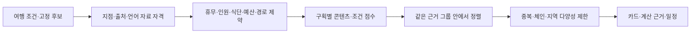

# 고잉 추천 모델 — hybrid_v4

2026-10-08. 코드에 연결한 콘텐츠·여행 조건 기반 추천 모델이다. 외부 LLM을 호출하거나 사용자 행동으로 학습한 모델은 아니다. **실제 추천 정확도·만족도는 아직 미측정**이다. 합성 평가 점수를 실제 사용자 성과로 읽지 않는다.

[기존 v3 설계 계약](RECOMMENDATION_MODEL_V3.md)은 이력으로 보존했다. 아래는 실제 구현한 v4 모델의 설명이다.

## 기존 모델에서 달라진 점

`general_v3`도 추천 모델이다. 현지어 리뷰는 언어 하한·상한, 유명한 곳은 근거 종류·평가 수를 차례로 비교하는 규칙 기반 모델이었다. 취향 태그의 일치율을 계산했지만 실제 정렬에는 사용하지 않았다. 명시한 거리 우선 외에는 숙소 거리도 기본 순위에 반영하지 않았다.

새 요청은 `hybrid_v4`를 snapshot에 저장한다. 예전 v1/v2와 `general_v3` 요청은 기존 방식으로 재현한다. 새로운 DB 마이그레이션이나 유료 API 키는 필요하지 않다. 배포 전 운영 서비스에는 적용되지 않는다.



## 계산에 쓰는 특징

### 취향: TF-IDF와 코사인 유사도

사용자가 직접 선택한 취향 태그와 확인된 장소 태그를 벡터로 만든다. 태그를 NFKC·소문자로 정규화하고 버전 관리하는 작은 사전으로 `초밥/寿司/sushi` 등을 연결한다. 자유문장 번역이나 음식·알레르기 조건을 추론하지 않는다.

태그 출현은 0/1, IDF는 `log((1+장소 수)/(1+해당 태그가 있는 장소 수))+1`이다. 두 벡터의 내적을 길이의 곱으로 나눈 코사인 유사도를 사용한다. 해당 구획에서 자격을 통과한 후보로만 IDF를 계산하며, 상위 K개로 자르기 전에 계산한다. 장소 태그가 없으면 유사도는 `null`이다. 확인한 태그가 서로 다르면 0이다.

이는 추천에 사용하는 특징 벡터 모델이며, 클릭·방문 정답으로 가중치를 학습한 지도학습은 아니다. [TF-IDF 정의](https://scikit-learn.org/stable/modules/generated/sklearn.feature_extraction.text.TfidfTransformer.html)를 참고했다. 무료 서버에 추가 라이브러리를 올리지 않도록 필요한 작은 계산을 표준 라이브러리로 구현했다.

### 평점: 평가 수를 반영한 평균 수축

평점 5.0/리뷰 1건과 평점 4.8/리뷰 600건을 원점수만으로 비교하지 않는다.

`보정 평점 = (평가 수 × 원평점 + 200 × 비교 집단의 평균 평점) / (평가 수 + 200)`

비교 집단은 **동일 플랫폼·도시·장소 분류·5점 척도**의 유효 후보다. 평균은 장소별 평균이며, 모든 플랫폼의 평균을 섞지 않는다. 200은 학습한 최적값이 아니라 초기 prior 강도다. 집단에 한 곳뿐이면 보정이 일어나지 않는다. 이 값은 맛의 확률·리뷰 진위·통계적 신뢰구간이 아니다.

### 거리: 숙소 등 명시한 출발점

위치가 확인된 출발점과 장소의 Haversine 직선거리 `d`를 사용한다.

`거리 성분 = 1 / (1 + d / 2000m)`

직선거리는 도보시간이 아니다. 실제 경로는 기존 경로 자료와 필수 이동 조건 검사에 사용하며, 확인되지 않은 경로를 0분으로 만들지 않는다. `가까운 곳 우선`을 고르면 같은 근거 그룹 안에서 직선거리를 먼저 비교한다.

### 구획 근거

| 구획 | core 성분 |
|---|---|
| 현지어 리뷰 | 현지어 보수적 하한 L/T의 70% + 같은 플랫폼 보정 평점/5의 30% |
| 유명한 곳·플랫폼 인기 | 보정 평점/5. 같은 플랫폼·도시·분류 안에서만 비교 |
| 유명한 곳·공식/편집 선정 | 출처 자격 통과 지표 1. 맛·인기도 100점이라는 의미가 아님 |
| 주변 장소 참고 | 지점 참고 자료의 자격 통과 지표 1. 엄격 추천을 대신하지 않음 |

현지어의 한국어 상한·미판별·판별 건수·이용 권한·언어 품질 검사는 **점수보다 앞선 필수 조건**이다. 기준을 넘는다고 임의로 켜지지 않는다. 운영 엄격 언어 기능은 여전히 OFF다.

## 입력에 따라 선언한 네 가지 프로필

| 요청 프로필 | core | 취향 | 거리 |
|---|---:|---:|---:|
| 선택 입력 없음 | 100% | 사용 안 함 | 사용 안 함 |
| 취향만 입력 | 55% | 45% | 사용 안 함 |
| 출발점만 입력 | 65% | 사용 안 함 | 35% |
| 취향·출발점 입력 | 40% | 40% | 20% |

모든 비중은 초기 가설이다. 프로필은 **사용자 입력으로 요청 시작 시 선택**하며 모델 버전·프로필·비중·상수를 snapshot에 저장한다. 후보마다 결측을 보고 비중을 다시 나누지 않는다.

어떤 필수 점수 성분이 없으면 순위용 `ranking_diagnostics.utility`는 null로 남긴다. 기존 장소 총점 필드 `score`는 계속 null로 두어 이 값을 장소 품질 총점으로 오인하지 않도록 했다. 알려진 기여의 합인 하한과, 미확인 비중을 추가한 상한을 진단에 기록하고 하한으로 정렬한다. 이는 **자료가 없는 성분의 가능한 점수 범위**이며 통계적 오차 범위가 아니다. 확인된 0과 미확인을 구분한다. 행동 피드백은 사용자가 반영을 선택한 장소만 기존 정책대로 우선순위를 절반으로 낮춘다.

공식 명소·플랫폼 인기·편집 선정은 서로 다른 그룹으로 유지한다. 다른 플랫폼의 보정 점수를 하나의 순위로 비교하지 않는다. 최종 동률은 canonical place ID로 해결한다.

## 화면과 재현성

추천 카드의 **이 추천의 계산 근거**에서 다음을 확인한다.

- 실제 사용한 성분, 비중, 미확인 항목
- 일치한 태그, 원평점·평가 수, 비교 집단의 장소 수
- 직선거리라는 한계와 피드백 반영 여부
- 모델 버전과 프로필, 행동 학습을 하지 않았다는 설명

DB에는 기존 추천 입력·후보·사실·정책·clock snapshot과 함께 `ranking_spec`을 보관한다. 결과에는 `ranking_diagnostics`를 저장한다. 동일 입력이면 후보 배열 순서가 달라도 같은 결과를 만들며 재조회 시 다시 학습·수집하지 않는다. 한 장소의 출처가 철회되면 IDF·평점 prior의 후보 집단도 달라질 수 있으므로 남은 카드의 파생 점수까지 오래된 상태로 처리하고 표시를 거둔다. GET에서 다시 정렬하거나 SQL의 기존 snapshot을 덮어쓰지 않는다. 원문 리뷰나 메일을 새 모델에 넣지 않는다.

## 평가 방법과 결과 해석

[실행 결과](reports/hybrid-v4-benchmark.md)와 [질의별 JSON](reports/hybrid-v4-benchmark.json)을 제공한다. 도쿄·바르셀로나에 대해 취향·거리·평점 표본·현지어+취향·선택 입력 없음·휴무/인원 위반의 **12개 합성 개발 시나리오**다. 사람이 독립적으로 평가한 holdout은 0개다. 같은 개발자가 작성한 기대 등급이므로 실제 추천 품질의 독립 검증이 아니다.

| 지표 | 정의 |
|---|---|
| NDCG@3 | 등급 0~3의 이득 `2^등급-1`을 순위별 `log2(순위+1)`로 할인하고 이상적 순서로 정규화 |
| Precision@3 | 상위 3칸 중 등급 2 이상인 수 / 3. 결과가 적어도 분모를 줄이지 않음 |
| Recall@3 | 상위 3칸의 등급 2 이상 수 / 고정 후보 전체의 등급 2 이상 수 |
| MRR@3 | 상위 3칸에서 처음 등급 2 이상이 나온 순위의 역수 |
| 안전성·결정성 | 표시한 결과의 필수 조건 위반 수, 입력 순서를 바꿔도 결과가 같은 질의 수 |
| 엔진 지연 | DB·검색·네트워크를 제외한 순수 함수의 중앙값·p95, 반복 수 함께 표시 |

관련성 정답은 모델 출력에서 만들지 않는다. 후보의 정답이 하나라도 빠지면 해당 질의 관련성 지표는 null이다. 관련 장소가 0개이면 Recall·MRR와 이상적 이득이 0인 NDCG도 null이다. 검사 실패율 0%를 추천 정확도 100%라고 표현하지 않는다. 정의는 [Recommenders 평가 문서](https://recommenders-team.github.io/recommenders/evaluation.html)를 참고했다.

```sh
# 이미 고정한 합성 fixture로 평가. API 호출 0회.
PYTHON_DOTENV_DISABLED=1 .venv/bin/python -m src.recommendations.benchmark \
  --fixture docs/service-v4/fixtures/hybrid-v4-development.json \
  --output /tmp/going-ranking-evaluation.json --repeats 5

# 합성 fixture의 작성 과정을 재현할 때만 실행
PYTHON_DOTENV_DISABLED=1 .venv/bin/python -m scripts.build_recommender_benchmark
```

## 실제 관련성 검증을 위한 다음 데이터

고정 입력 형식은 위 fixture와 같다. 실제 데이터에는 `label_source=independent_human`을 사용한다. `queries`마다 `id`, `split`, `section`, `snapshot`, `candidates`, `judgments`, `reviewer_id`를 지정한다. `reviewer_id`는 가명으로 쓰고 이메일·건강 정보·정밀 개인 위치를 공개 보고서에 넣지 않는다. 개인 요청 snapshot·후보는 권한이 있는 로컬 파일로만 평가하고 공개 저장소에 올리지 않는다.

1. 사용 가능한 실제 후보를 고정하고 실제 출처·지점·방문 조건을 검수한다. 개발셋과 최종 평가셋을 미리 분리한다.
2. 평가자에게 알고리즘 순위를 숨긴 상태로 여행 조건과 후보를 보여준다. 각 후보를 0(부적합), 1(약한 관련), 2(적합), 3(매우 적합)으로 독립 평가한다. 미평가 값을 0으로 채우지 않는다.
3. 최종 평가셋을 보며 가중치를 조정하지 않는다. 같은 고정 요청을 개발·평가 양쪽에 넣으면 CLI가 거절한다. 다른 여행·도시·사용자로 분리했는지 사람도 검수한다.
4. 같은 CLI로 두 모델의 순위·지표·확인 필요 목록·안전성을 비교한다. 미확인 방문 조건은 검증 완료 추천과 다른 목록으로 남긴다.
5. 후보 수·질의 수·도시·분류·언어 근거 유무별 수치를 보고한다. 오프라인 선호 평가와 방문 만족도는 구분한다.

자료가 쌓이면 pairwise 학습 순위 모델을 비교할 수 있다. 지금 임의의 클릭이나 가짜 방문을 만들어 학습하지 않았다. 태그 품질과 실제 리뷰 이용·언어 판별 검증이 먼저다. 사전에 자른 후보 최대 100개 밖의 장소는 이 순위 모델이 복구할 수 없다. IDF·평점 prior도 고정 후보 안에서만 계산하므로 후보 구성이 바뀐 결과를 알고리즘 변화로 해석하면 안 된다.

## 발표에서 설명하는 예시

“처음에는 현지어 리뷰 비율이나 평가 수를 기준으로 순서를 정했습니다. 그런데 초밥을 좋아한다고 입력해도 순위에 충분히 반영되지 않았습니다. 그래서 지금은 선택한 취향과 장소 태그를 TF-IDF 벡터로 만들고 코사인 유사도를 계산합니다. 숙소 거리와 리뷰 수를 고려한 평점도 함께 사용합니다. 다만 휴무나 인원 조건을 위반한 곳은 점수가 높아도 추천하지 않습니다. 같은 여행 조건과 후보를 고정해 이전 버전과 비교하는 평가 도구도 만들었습니다. 현재 결과는 합성 시나리오 시험이며, 실제 추천 정확도는 독립적인 사용자 평가 자료를 모아 확인할 예정입니다.”

## 구현 위치

- `src/recommendations/hybrid.py`: 특징·수축 평점·프로필·점수·순위
- `src/recommendations/registry.py`: 버전과 새 요청의 기본 모델
- `src/recommendations/general.py`: 기존 자격·방문 조건·다양성 파이프라인 재사용
- `src/recommendations/benchmark.py`: 고정 입력·별도 정답·지표·지연 평가 CLI
- `web/js/discovery-experience.js`: 사용자 계산 근거 화면
- `tests/test_hybrid_recommender.py`: 모델·분모·결측·제약·저장 API 시험
